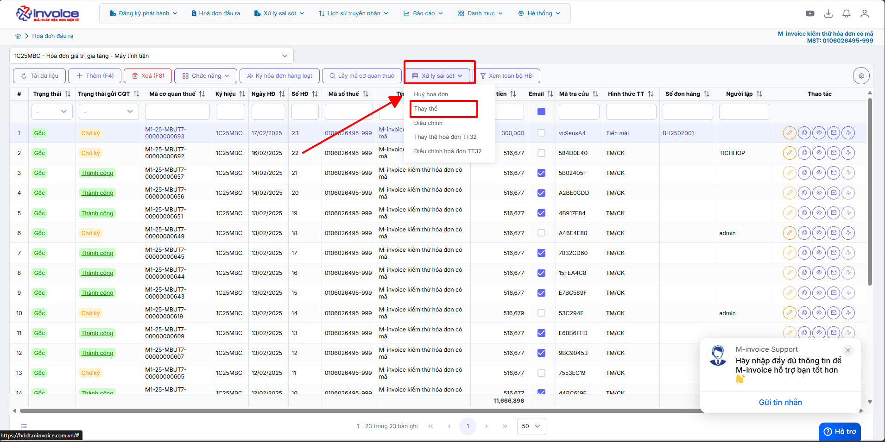
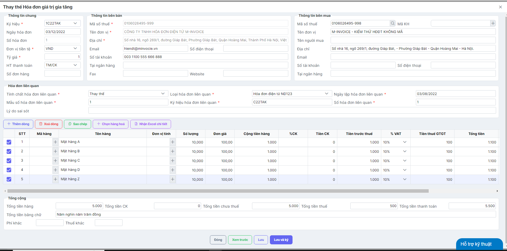
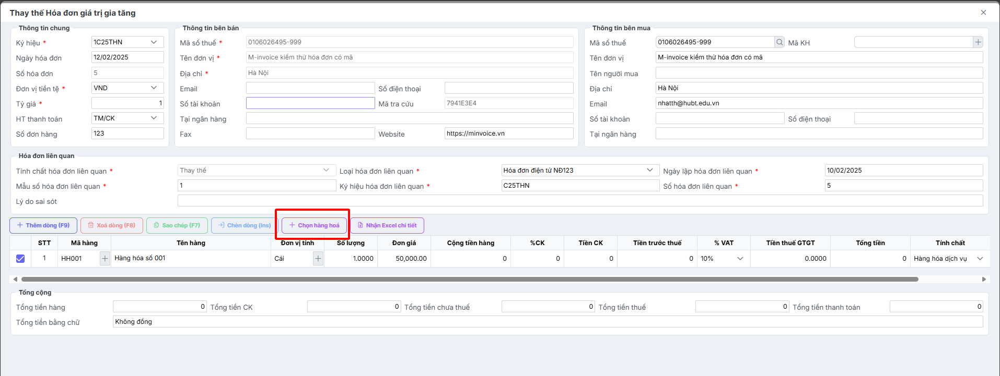
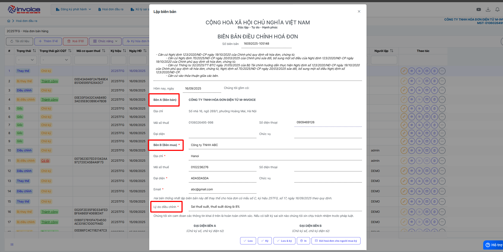

# **Thay thế hoá đơn**

Dưới đây là những hướng dẫn thao tác cơ bản trên phần mềm hóa đơn điện tử M-Invoice ở phiên bản 2.0 vô cùng mạch lạc và dễ hiểu.

## **Hướng dẫn thay thế hóa đơn có sai sót**

???+ Note "Ghi chú"

    Trong quá trình phát hành hóa đơn không tránh khỏi những sai sót. Sau đây, M-Invoice hướng dẫn NSD thực hiện xử lý hóa đơn đã lập có sai sót như sau:
    Thay thế hoá đơn (Áp dụng cho HĐ trong kỳ kê khai(chưa kê khai)) và chỉ được phép sử dụng nghiệp vụ thay thế hóa đơn với các điều kiện sau:

    1. Hóa đơn cần thay thế đã được gửi CQT thành công hoặc hóa đơn đã có mã CQT cấp
    2. Hóa đơn cần thay thế ở Trạng thái Gốc (Mới) hoặc Thay thế

???+ Warning "Lưu ý"

    Nếu đã lựa chọn nghiệp vụ thay thế thì không được Hủy hóa đơn Thay thế hoặc Bị Thay thế, cũng không được điều chỉnh hóa đơn thay thế. Nghiệp vụ này không bắt buộc phải phải lập 04/SS

**Thao tác cài đặt và thực hiện như sau**

<iframe style="width: 43rem; height: 380px" src="https://www.youtube.com/embed/2yVVe_lBgW0?si=gJyIo4SUDCbSe9Sn" title="YouTube video player" frameborder="0" allow="accelerometer; autoplay; clipboard-write; encrypted-media; gyroscope; picture-in-picture; web-share" referrerpolicy="strict-origin-when-cross-origin" allowfullscreen></iframe>

**Hướng dẫn sử dụng bằng hình ảnh nếu Quý khách không xem được video**

### **Bước 1: Chọn hóa đơn cần thay thế**

### **Bước 2: Chọn phần Xử lý sai sót --> Thay thế**

### **Bước 3 : Điền lại nội dung thông tin hóa đơn**

Bạn có thể chọn lại dòng hàng hoá cũ ở hoá đơn trước đó

### **Bước 4 : Lưu nội dung hóa đơn và ký gửi**

Sau khi Thay thế nội dung hóa đơn thành 1 hóa đơn đúng. Người sử dụng có thể Ký và gửi hóa đơn đã được lập Thay thế như một hóa đơn thông thường.

## Hướng dẫn lập biên bản hoá đơn thay thế

???+ Danger "Hướng dẫn lập biên bản"

    Theo Nghị định 70/2025/NĐ-CP, việc lập Biên bản điều chỉnh/thay thế chứng từ điện tử khấu trừ thuế TNCN là bắt buộc trong các trường hợp có sai sót.

!!! Note "Ghi chú"

    Người sử dụng có thể sử dụng thao tác này để lập biên bản khi làm nghiệp vụ thay thế hay điều chỉnh hóa đơn

!!! warning "Lưu ý"

    Chỉ lập được khi ở trạng thái thay thế hoặc điều chỉnh

### **Bước 1: Truy cập mục xử lý sai sót**

Sau khi đã làm thay thế hoặc điều chỉnh

Chọn lập biên bản

### **Bước 2: Kiểm tra thông tin người bán, người mua, điền lý do thay thế hoặc lý do điều chỉnh**

### **Bước 3 : Lưu hoặc ký biên bản thay thế, điều chỉnh**

Hiện tại chỉ ký được biên bản nếu cks là cks hsm

### **Bước 4 : Xem và in biên bản**

Bấm nút in ở trình duyệt hoặc bấm ctrl + P để in

???+ info "Xin chân thành cảm ơn quý khách hàng đã tin dùng sản phẩm của M-Invoice"

    Có bất kỳ vướng mắc nào trong quá trình sử dụng hãy liên hệ với M-Invoice tại mục Hỗ trợ kỹ thuật góc phải bên dưới màn hình hoặc gọi tổng đài kỹ thuật của M-Invoice (1900.955.557 Nhánh 1)

Last updated on <strong>Jun 17, 2025</strong> by <strong>nhatth</strong>

