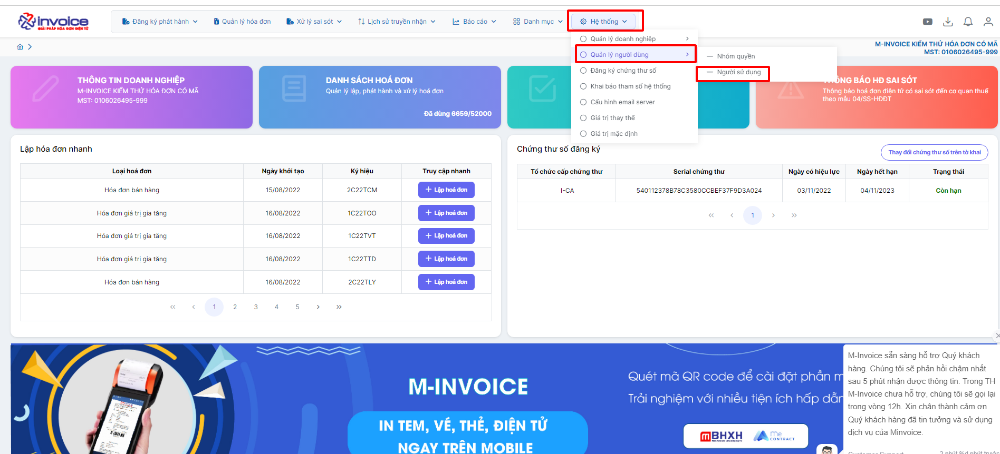
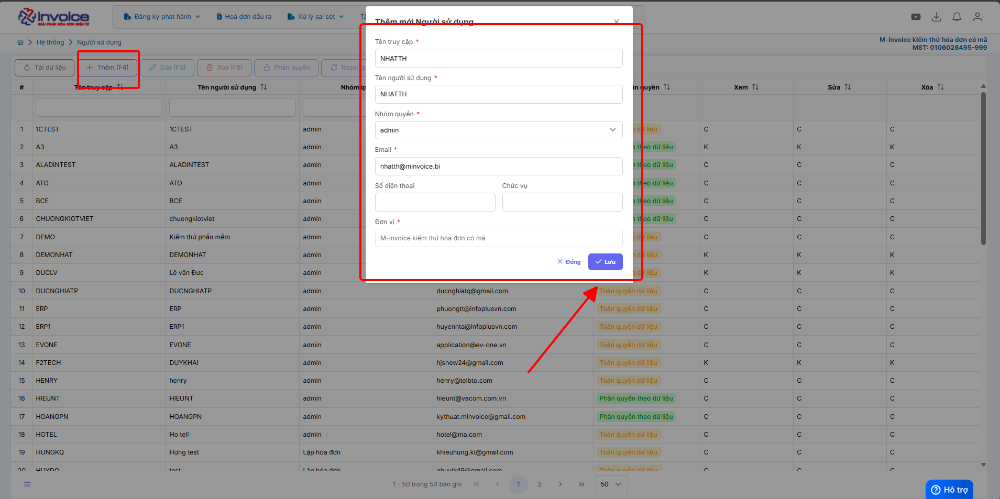

# **Thêm tài khoản người dùng**

Dưới đây là những hướng dẫn thao tác cơ bản trên phần mềm hóa đơn điện tử M-Invoice ở phiên bản 2.0 vô cùng mạch lạc và dễ hiểu.

## **Cách tạo thêm tài khoản người dùng**

???+ Note "Ghi chú"

    Trong quá trình sử dụng phần mềm hóa đơn điện tử M-invoice, có nhiều người sử dụng phần mềm chung 1 tài khoản sẽ có bất tiện, sau đây Minvoice sẽ hướng dẫn tạo thêm user để có thể phân quyền quản lý dễ dàng hơn

### **Bước 1: Hệ thống --> Quản lý người dùng --> Người sử dụng**

### **Bước 2: Nhấm Thêm(F4) để bắt đầu thêm người dùng mới**

!!! Note ""

    Điền đầy đủ các thông tin cần thiết như **Tên truy cập , nhóm quyền, địa chỉ mail**

    Sau khi đã điền đẩy đủ thông tin bạn nhấn **Lưu**, tài khoản và mật khẩu sẽ được gửi về mail mà bạn đăng ký

???+ info "Xin chân thành cảm ơn quý khách hàng đã tin dùng sản phẩm của M-Invoice"

    Có bất kỳ vướng mắc nào trong quá trình sử dụng hãy liên hệ với M-Invoice tại mục Hỗ trợ kỹ thuật góc phải bên dưới màn hình hoặc gọi tổng đài kỹ thuật của M-Invoice (1900.955.557 Nhánh 1)

