# **Hướng dẫn xuất hóa đơn xăng dầu**

Dưới đây là những hướng dẫn thao tác cơ bản trên phần mềm hóa đơn điện tử M-Invoice ở phiên bản 2.0 vô cùng mạch lạc và dễ hiểu.

## **Sau khi anh/chị đăng nhập thành công**

**Tại trang chủ**

### **Bước 1: Anh/chị chọn Danh mục --> Danh sách giao dịch xăng dầu**

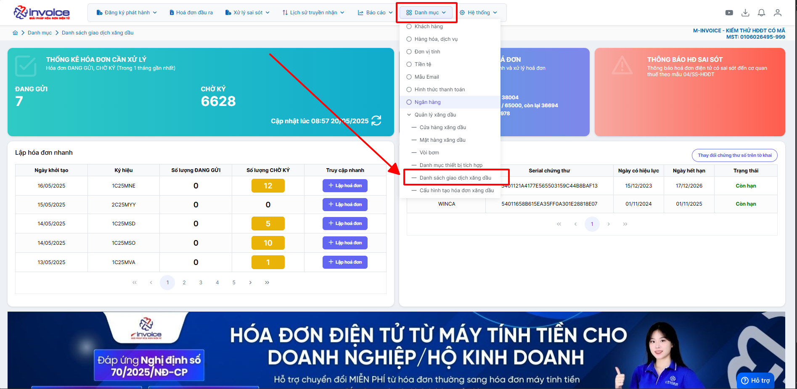

### **Bước 2:**

**2.1: Tại giao diện “Danh sách giao dịch xăng dầu” có các log giao dịch được đẩy lên từ cò bơm**

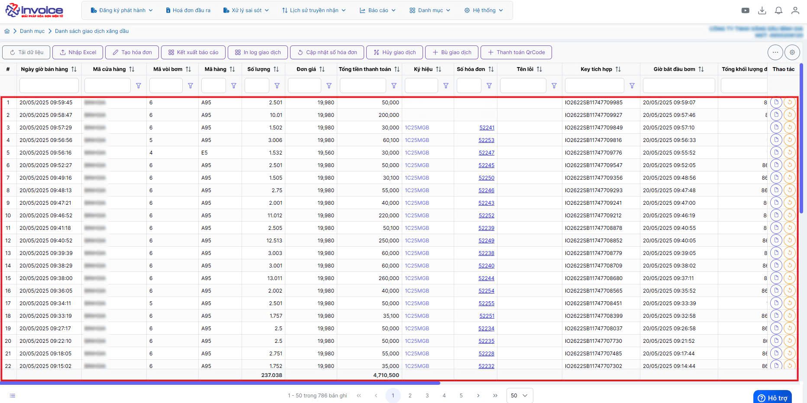

**2.2: Anh/chị chọn log cần tạo hóa đơn (Màu xanh nhạt là hóa đơn được chọn)**

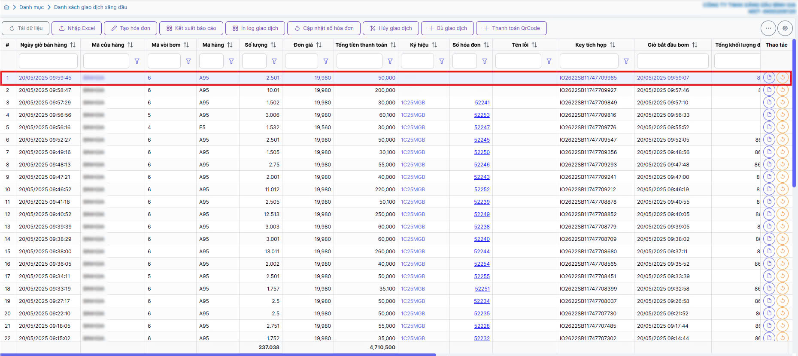

**2.3: Anh/chị chọn mục “tạo hóa đơn” để tạo hóa đơn**

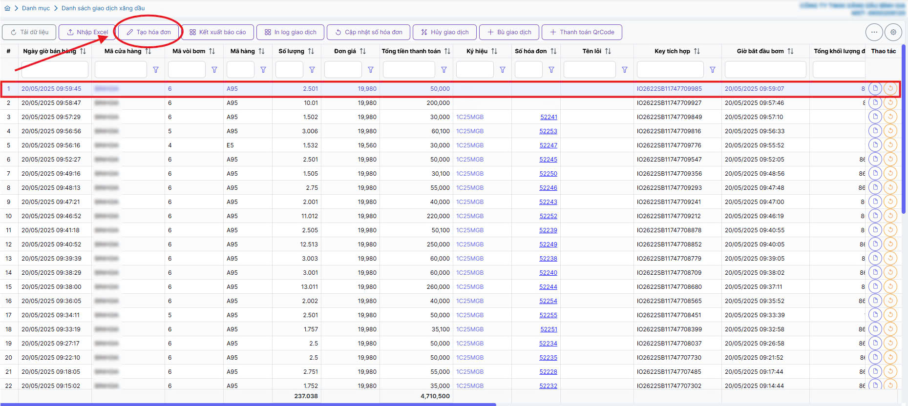

**2.4: Tại mục thông tin khách hàng**

TH1: Xuất hóa đơn khách lẻ không lấy hóa đơn

Hệ thống mặc định để khách lẻ không lấy hóa đơn cho anh/chị

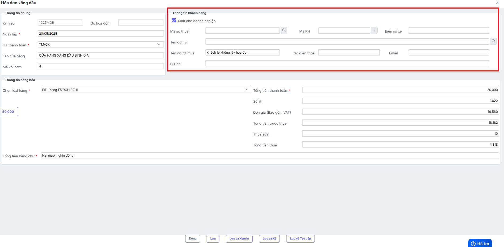

Kiểm tra đủ thông tin khách hàng anh/chị nhấn “Lưu” để tạo hóa đơn

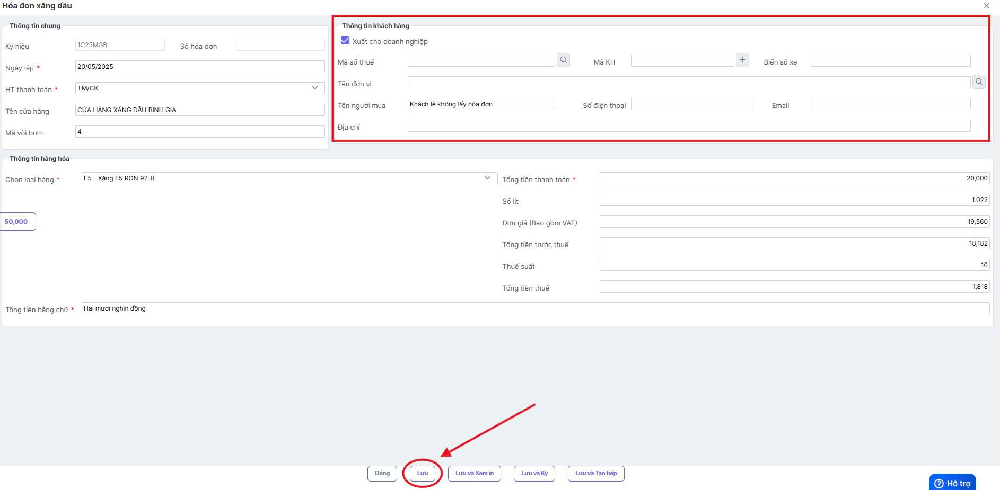

TH2: Xuất hóa đơn cho doanh nghiệp

Anh/chị tích chọn phần “Xuất cho doanh nghiệp”

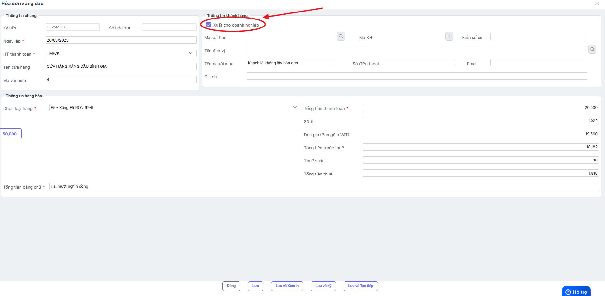

Anh/chị điền mã số thuế và chọn biểu tượng “Kính lúp” hệ thông tự động điền thông tin khách hàng.

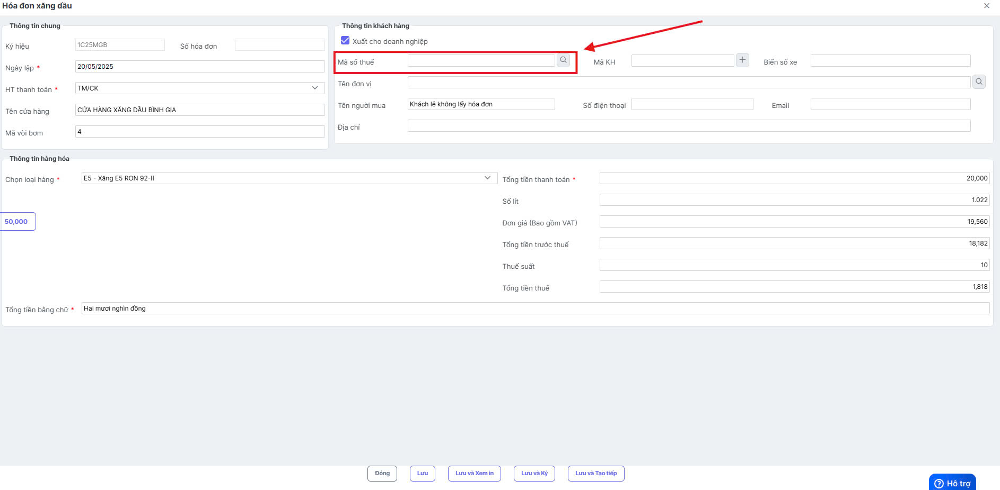

Kiểm tra đủ thông tin khách hàng anh/chị nhấn “Lưu” để tạo hóa đơn

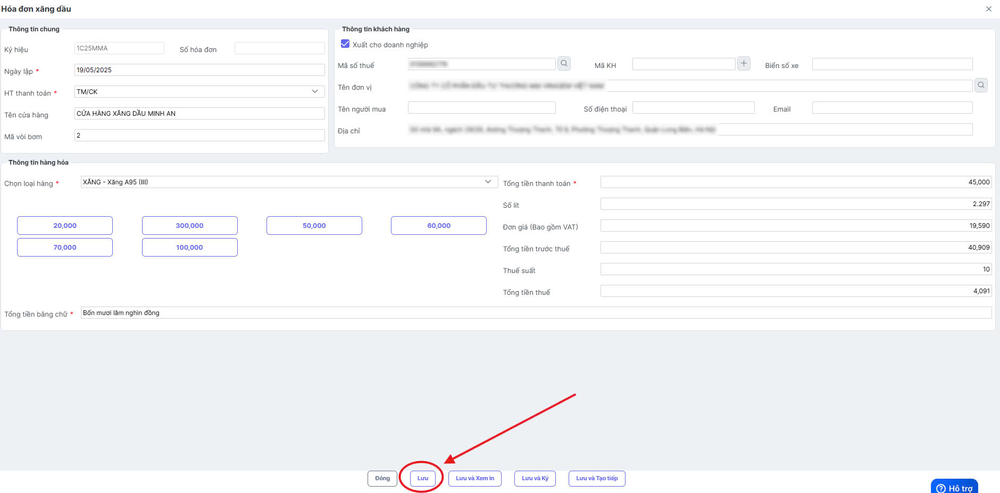

### **Bước 3 : Anh/chị quay trở lại “Danh sách giao dịch” tại log giao dịch cột “Số hóa đơn” hiển thị số hóa đơn đã tạo**

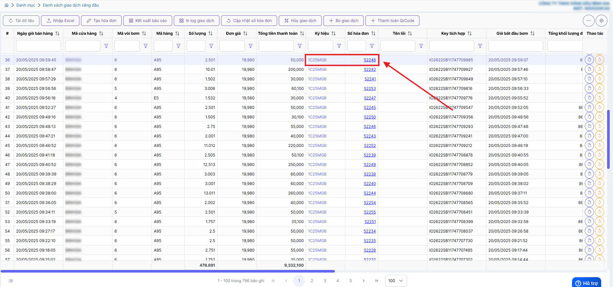

### **Bước 4 : Anh/chị vào mục “hóa đơn đầu ra”**

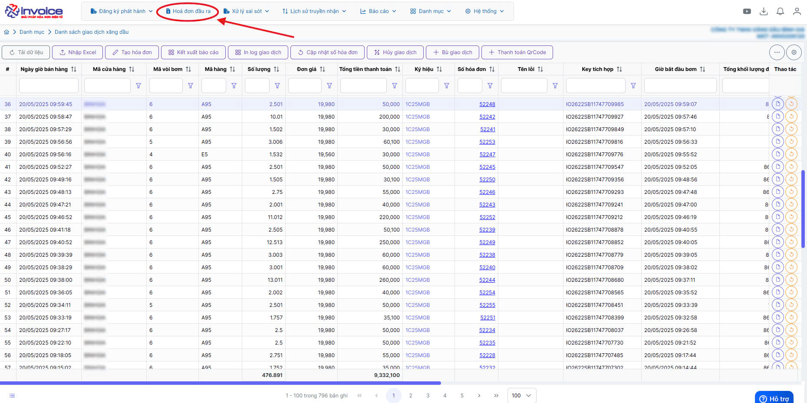

### **Bước 5 : Anh/chị chọn ký hiệu hóa đơn tương ứng**

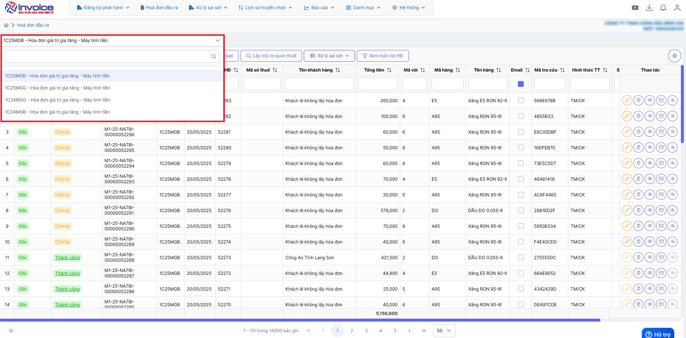

### **Bước 6 : Anh/chị nhập số hóa đơn tại cột “Số HĐ”**

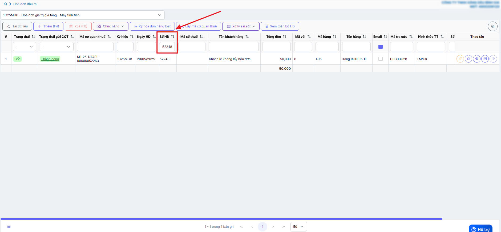

### **Bước 7 : Anh chị chọn biểu tượng “xem in” để kiểm tra thông tin hóa đơn**

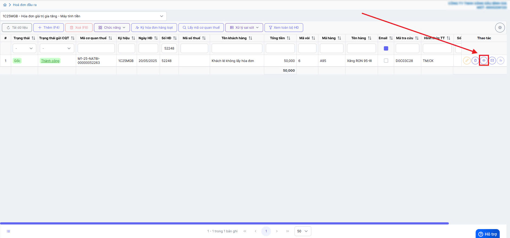

### **Bước 8 : Anh/chị chọn “ký gửi CQT”**

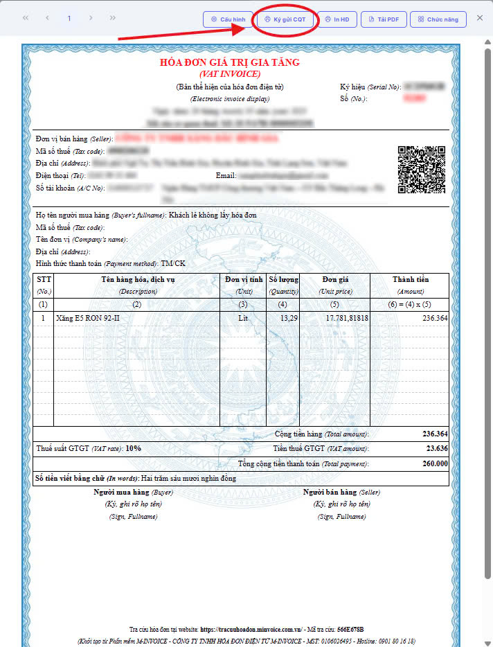

???+ info "Xin chân thành cảm ơn quý khách hàng đã tin dùng sản phẩm của M-Invoice"

    Có bất kỳ vướng mắc nào trong quá trình sử dụng hãy liên hệ với M-Invoice tại mục Hỗ trợ kỹ thuật góc phải bên dưới màn hình hoặc gọi tổng đài kỹ thuật của M-Invoice (1900.955.557 Nhánh 1)

