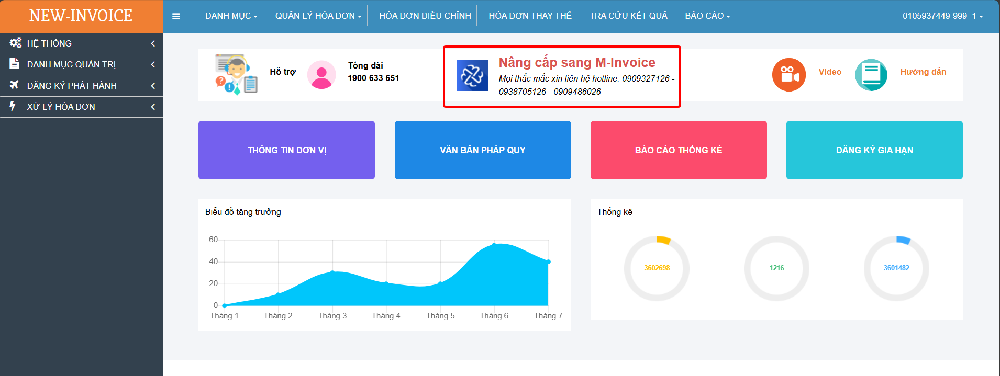
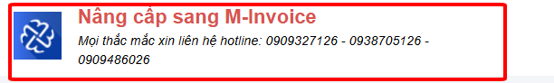
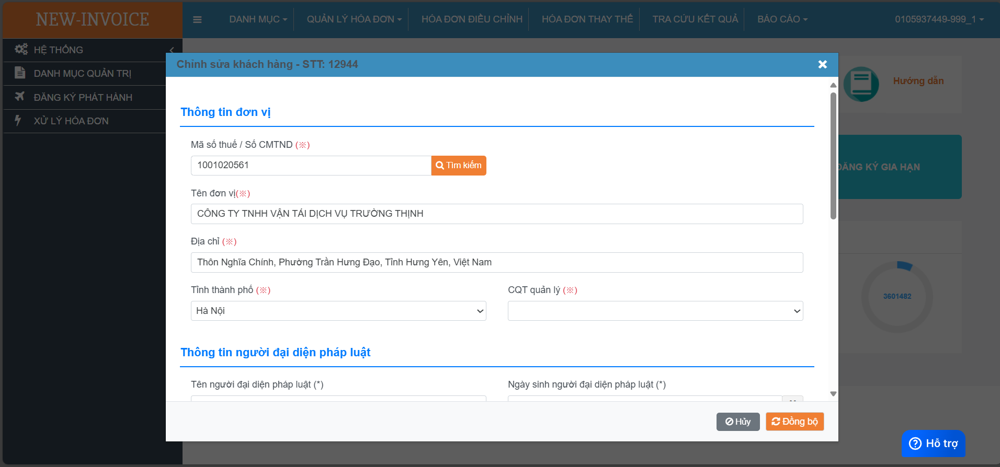
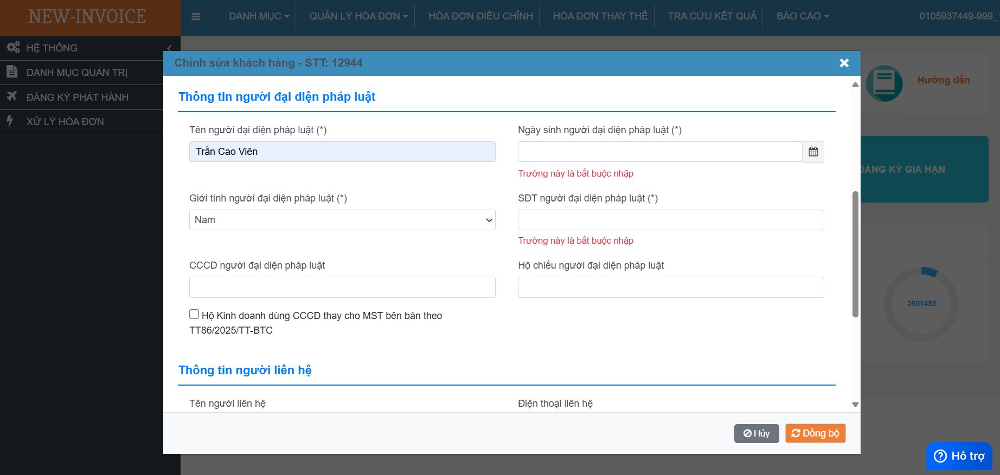
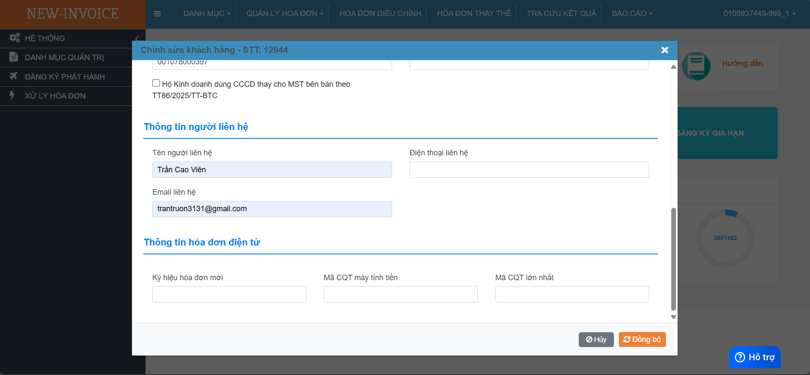
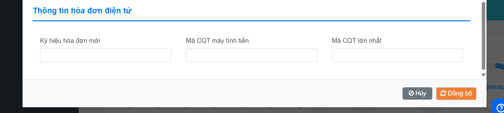
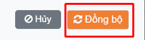

# **Hướng dẫn chuyển đổi sang hệ thống M-invoice**

???+ note "Mục đích"

    **Chức năng này dành cho Khách hàng chủ động chuyển đổi qua Hệ thống hóa đơn điện tử M-invoice.**

    <strong>MIỄN PHÍ</strong>

---

**Hướng dẫn:**

Sau khi đăng nhập vào phần mềm **New-invoice**, giao diện sẽ hiển thị mục

"<strong>Nâng cấp sang M-invoice</strong>" ngay tại màn hình Dashboard.

• Click vào vùng có biểu tượng: {: style="height:50px"} Chương

trình sẽ hiển thị ra màn hình khai báo thông tin chuyển đổi.

---

Tại màn hình chuyển đổi, Quý khách kiểm tra và nhập đầy đủ thông tin có trên màn hình gồm các thành phần sau:

• **Thông tin đơn vị**: Tại mục này, chương trình sẽ hiển thị các thông tin về Doanh nghiệp. Quý khách kiểm tra thông tin và bổ sung các thông tin còn thiếu như Tỉnh / Thành phố và Cơ quan thuế (CQT) quản lý.

---

**• Thông tin người đại diện pháp luật:**  
Khách hàng điền đầy đủ thông tin người đại diện pháp luật, các thông tin người đại diện phải **trùng khớp với thông tin tài khoản VNeID của chủ Doanh nghiệp**.  
Thông tin này phục vụ để **sinh trắc học với CQT thông qua ứng dụng eTaxMobile của Cục thuế**.

o **Ngày sinh người đại diện pháp luật** có định dạng `DD/MM/YYYY` (VD: `01/11/1970`)

o **Giới tính người đại diện pháp luật:** Nam / Nữ

o **Điền SĐT người đại diện pháp luật:** Là số điện thoại di động đăng nhập VNeID của người đại diện

o **Điền căn cước công dân:** là chuỗi ký tự số gồm 12 chữ số (VD: `001078010101`) hoặc **hộ chiếu người đại diện pháp luật** gồm 8 ký tự, số đầu tiên là **chữ cái viết hoa** và 7 ký tự số (VD: `A1234567`)

🏪 Trường hợp là Hộ kinh doanh

**• Nếu là Hộ kinh doanh:**  
Quý khách cần **Tích chọn** _Hộ Kinh doanh dùng CCCD thay cho Mã số thuế (MST)_

• **Thông tin người liên hệ**: Quý khách cần nhập đúng thông tin để giúp M-invoice có thể kịp thời hỗ trợ. **Thông tin Email cần chính xác** để khi chuyển đổi hoàn tất, M-invoice sẽ gửi thông tin tài khoản đăng nhập về hệ thống Hóa đơn điện tử M-invoice.

**• Thông tin hóa đơn hóa đơn điện tử:**  
Thông tin này giúp việc xuất hóa đơn chuyển đổi hệ thống **tránh bị trùng lặp** thông tin đã sử dụng như **Ký hiệu**, **Mã số CQT lớn nhất** mà Quý khách hàng đã sử dụng.

---

**• Ký hiệu hóa đơn mới:**  
Cần khai báo **không trùng lặp** với Ký hiệu đã sử dụng.  
Chương trình sẽ mặc định Ký hiệu cuối cùng là **YY**. VD khai báo như sau:

o `1C25T` + 2 ký tự cuối bất kỳ với hóa đơn **GTGT**

o `2C25T` + 2 ký tự cuối bất kỳ với hóa đơn **bán hàng**

\_(ví dụ: `1C25TNH` hoặc `2C25THL` — <strong>**Lưu ý:** 2 ký tự cuối không được trùng với ký hiệu hóa đơn ở phần mềm cũ)</strong>

---

**• Mã CQT Máy tính tiền:**  
Là mã gồm **5 ký tự** do **Cơ quan thuế cấp** khi Doanh nghiệp đăng ký sử dụng loại hóa đơn là **Máy tính tiền**.  
Mã này được **CQT gửi qua email** kèm theo **Chấp thuận việc đăng ký sử dụng**.  
Quý khách có thể tìm thông tin tại **email đã đăng ký với CQT**.

---

**• Mã Cơ quan thuế lớn nhất:**  
Nếu Quý khách hàng đang sử dụng **Hóa đơn điện tử khởi tạo từ Máy tính tiền của New-Invoice**, thì cần nhập thông tin là **Số Mã CQT lớn nhất đã sử dụng**.  
Việc **nhập thiếu sẽ dẫn đến lỗi trùng mã CQT** khi sử dụng sang hệ thống hóa đơn điện tử mới.

---

**• <strong>“Đồng bộ”</strong>:** {: style="height:50px"}
Khi thực hiện **Đồng bộ**, hệ thống sẽ **tự động khởi tạo và kích hoạt tài khoản** sử dụng trên hệ thống hóa đơn điện tử **M-invoice**.

Thông tin tài khoản (**Link đăng nhập**, **User**, và **Password**) sẽ được **gửi vào Email liên hệ** khách hàng đã điền ở mục **“Thông tin người liên hệ”**.

**Nếu có bất kỳ vướng mắc nào trong quá trình nâng cấp hoặc hướng dẫn sử dụng phần mềm, vui lòng liên hệ theo số hotline hiển thị trên màn hình**

---

**Xin trân trọng cảm ơn quý khách hàng!**

Last updated on <strong>Aug 02, 2025</strong> by <strong>NHATTH</strong>

