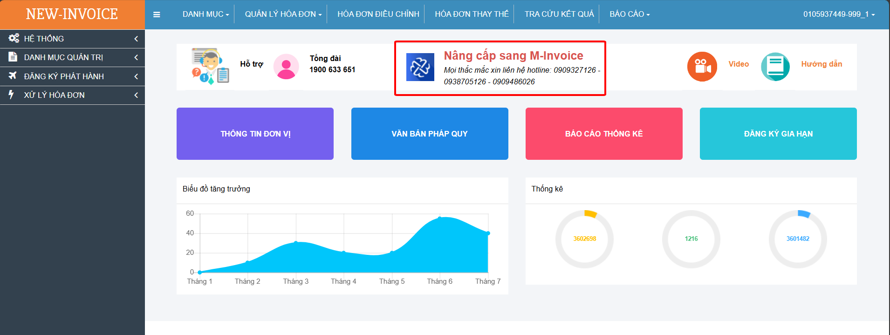
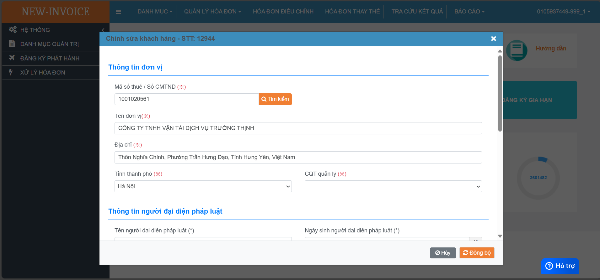
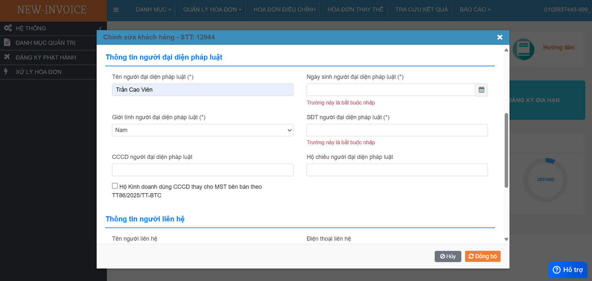
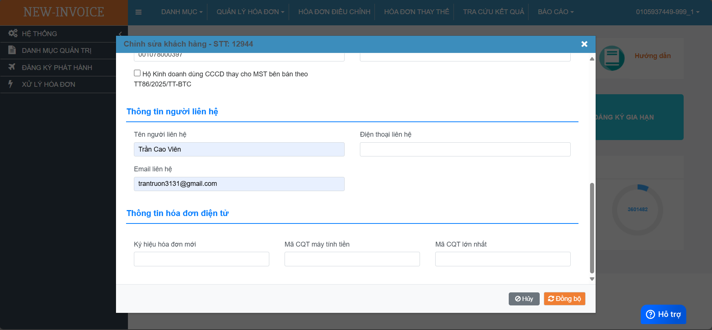

# **Chuyển đổi M-invoice**

Khách hàng có thể **tự chủ động chuyển đổi** bằng các bước sau:

---

Sau khi đăng nhập vào phần mềm **Newinvoice**, giao diện sẽ hiển thị mục

"<strong>Nâng cấp sang M-invoice</strong>"

- Sau khi ấn vào mục "<strong>Nâng cấp sang M-invoice</strong>" sẽ xuất hiện bảng thông tin để khách hàng nhập thông tin
- Ở phần thông tin đơn vị khách hàng kiểm tra lại thông tin liên quan, bấm lại nút "<strong>Tìm kiếm</strong>" nếu trong trường hợp địa chỉ mới chưa được cập nhật đúng

---

- Khách hàng điền đầy đủ thông tin người đại diện pháp luật (lưu ý thông tin quan trong liên quan tới tờ khai gửi CQT):

- 🗓️ Chọn ngày sinh người đại diện pháp luật hoặc điền theo định dạng `DD/MM/YYYY`  
  _Ví dụ: `01/11/1970`_
- 🚻 **Giới tính**: Chọn giới người đại diện pháp luật
- 📱 **Số điện thoại** người đại diện pháp luật
- 🆔 **CMND/CCCD hoặc Hộ chiếu** người đại diện pháp luật

---

**Thông tin người liên hệ và thông tin hóa đơn hóa đơn điện tử:**

- Điền số điện thoại liên hệ và Email liên hệ (có thể để thông tin trùng với thông tin người đại diện pháp luật hoặc không)

- Điền ký hiệu hóa đơn mới theo định dạng:

1C25T + 2 ký tự cuối bất kỳ với hóa đơn GTGT

2C25T + 2 ký tự cuối bất kỳ với hóa đơn bán hàng

(ví dụ: 1C25TNH hoặc 2C25THL - <strong>Lưu ý: 2 ký tự cuối không được trùng với ký hiệu hóa đơn ở phần mềm cũ</strong>)

- Sau đó ấn "<strong>Đồng bộ</strong>"

**Link và tài khoản đăng nhập sẽ được gửi vào Email liên hệ khách hàng đã điền ở mục “Thông tin người liên hệ”.**

Nếu có bất kỳ **vướng mắc** nào trong quá trình nâng cấp hoặc hướng dẫn sử dụng phần mềm, vui lòng liên hệ theo số **hotline hiển thị trên màn hình**

---

**Xin trân trọng cảm ơn quý khách hàng!**

Last updated on <strong>Aug 02, 2025</strong> by <strong>NHATTH</strong>

