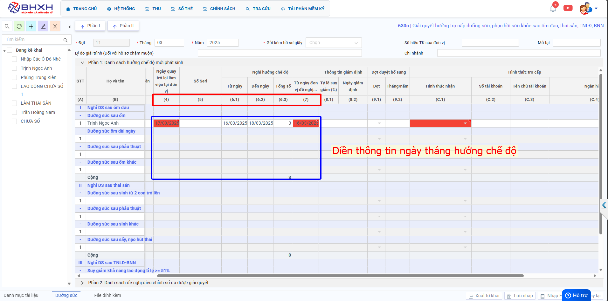

# **Chế độ dưỡng sức**

## **HƯỚNG DẪN KÊ KHAI BÁO CHẾ ĐỘ DƯỠNG SỨC, PHỤC HỒI SỨC KHỎE TRÊN PHẦN MỀM M-BHXH**

**Thao tác cài đặt và thực hiện như sau**

<iframe style="width: 43rem; height: 380px" src="https://www.youtube.com/embed/SYCNQKCwbuM?si=x7DqvmTojBDkKth0" title="YouTube video player" frameborder="0" allow="accelerometer; autoplay; clipboard-write; encrypted-media; gyroscope; picture-in-picture; web-share" referrerpolicy="strict-origin-when-cross-origin" allowfullscreen></iframe>

**Hướng dẫn sử dụng bằng hình ảnh nếu Quý khách không xem được video**

### Bước 1: Đơn vị Đăng nhập vào phần mềm → chọn “CHÍNH SÁCH” → Hồ sơ 630c “Giải quyết hưởng trợ cấp dưỡng sức, phục hồi sức khỏe sau ốm đau, thai sản, TNLĐ, BNN” → ấn “Lập tờ khai”.

### Bước 2: Sau khi chọn lập tờ khai thì chuyển sang sheet " Dưỡng sức" để tiến hành kê khai hồ sơ.

Bên trong hồ sơ kê khai, đơn vị “tích tên NLĐ” bên phía tay trái chọn phần I hoặc II tùy theo tình hình hồ sơ. Trong đó:

- Phần I: danh sách hưởng chế độ mới phát sinh
- Phần II: danh sách đề nghị điều chỉnh sổ đã được giải quyết

Sau khi chọn lập tờ khai thì chuyển sang sheet " Dưỡng sức" để tiến hành kê khai hồ sơ.

Mỗi phần sẽ chia thành các mục nhỏ, hãy chọn đúng mục tương ứng để điền đúng thông tin. Các mục bôi đỏ và mục có dấu \* sẽ là mục không được để trống.

Một số cột cần lưu ý:

- Cột 4: Ngày quay trở lại làm việc tại đơn vị: Kê khai ngày đầu tiên quay trở lại làm việc tại đơn vị sau khi nghỉ hết chế độ: ốm đau, thai sản, tai nạn lao động - Bệnh nghề nghiệp.
- Cột: 6.1: Từ ngày: Từ ngày đầu tiên NLĐ nghỉ chế độ dưỡng sức.
- Cột 6.2: Đến ngày: Ngày cuối cùng NLĐ nghỉ hưởng chế độ dưỡng sức.
- Cột 6.3: Tổng số: tổng số ngày nghỉ hưởng chế độ dưỡng sức.
- Cột 7: Từ ngày đơn vị đề nghị hưởng: Để từ ngày đầu tiên NLĐ bắt đầu nghỉ hưởng chế độ (Điền giống cột 6.1).

Cột (C.1): “ Hình thức nhận” Đơn vị tích chọn.

- Nếu chọn “Chi trả qua đơn vị” thì trên cùng màn hình ô Số hiệu tài khoản đơn vị điền số tài khoản của đơn vị Mở Tại Ngân hàng…Chi Nhánh… điền thêm (C.2) (C.3) (C.4)
- Nếu Tích chọn “ Chi trả qua ATM” thì đơn vị điền số tài khoản của người lao động vào cột (C.2), (C.3), (C.4). Để trống thống tin ô số hiệu tài khoản đơn vị ở trên cùng màn hình.

Đơn vị kê khai điền hết thông tin yêu cầu xong ấn “Xuất Tờ khai’ và đơn vị cắm “Chữ kí số” ấn “Nộp tờ khai”

???+ Warning "Lưu ý"

    Nộp tờ khai thành công đơn vị gửi luôn “hồ sơ giấy” lên cơ quan bảo hiểm qua đường bưu điện, bảo hiểm nhận được hồ sơ điện tử và hồ sơ giấy để giải quyết.

Trên đây là các bước thực hiện hưởng chế độ trợ cấp dưỡng sức, phục hồi sức khỏe sau ốm đau, thai sản, TNLĐ, BNN trên phần mềm M-BHXH.

!!! info "Xin chân thành cảm ơn Quý khách hàng đã tin dùng sản phẩm của M-Invoice"

    Có bất kỳ vướng mắc nào trong quá trình sử dụng hãy liên hệ với M-Invoice tại mục Hỗ trợ kỹ thuật góc phải bên dưới màn hình hoặc gọi tổng đài kỹ thuật của M-Invoice (1900.955.557 Nhánh 2)

