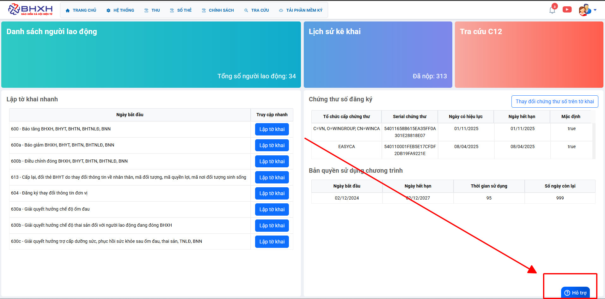

# **Chế độ ốm đau 630a**

## **HƯỚNG DẪN KÊ KHAI BÁO CHẾ ĐỘ ỐM ĐAU THÔNG THƯỜNG TRÊN PHẦN MỀM M-BHXH**

**Thao tác cài đặt và thực hiện như sau**

<iframe style="width: 43rem; height: 380px" src="https://www.youtube.com/embed/u7jMduvjaig?si=voWCu2J3czpnAr9F" title="YouTube video player" frameborder="0" allow="accelerometer; autoplay; clipboard-write; encrypted-media; gyroscope; picture-in-picture; web-share" referrerpolicy="strict-origin-when-cross-origin" allowfullscreen></iframe>

**Hướng dẫn sử dụng bằng hình ảnh nếu Quý khách không xem được video**

### Bước 1: Đơn vị Đăng nhập vào phần mềm → chọn “CHÍNH SÁCH” → Hồ sơ 630a “Giải quyết hưởng chế độ ốm đau” → ấn “Lập tờ khai”.

### Bước 2: Vào bên trong hồ sơ kê khai, đơn vị “tích tên NLĐ” bên phía tay trái chọn “PhầnI” mục “Bản thân ốm thường”.

???+ Warning "Lưu ý"

    **Kê khai Phần 1** là đối với Hồ sơ mới phát sinh Phần 2 là Đối với Hồ sơ đề nghị điều chỉnh số đã được giải quyết ( Hồ sơ gửi đi được duyệt và đã Hưởng tiền, sau phát hiện sai sót cần điều chỉnh lại đơn vị kê khai vào Phần 2).

### Bước 3: Điền các trường thông tin yêu cầu trên lưới kê khai

Cột (5) Nghỉ hàng tuần: Đơn vị tích chọn ngày nghỉ hàng tuần tại đơn vị

Cột (7.1) Từ ngày: Đơn vị điền ngày/tháng/năm đầu tiên người lao động thực tế nghỉ.
Cột (7.2): Đến ngày: Đơn vị điền ngày/tháng/năm cuối cùng người lao động thực tế nghỉ.
Cột (7.3) Tổng Số: Đơn vị điền Tổng số ngày người lao động nghỉ việc trong kỳ đề nghị giải quyết (Lưu ý:không tính ngày nghỉ hàng tuần tại đơn vị, chỉ tính ngày làm việc thực tế)
Cột (7.4) Từ ngày đơn vị đề nghị hưởng: Đơn vị điền ngày/ tháng /năm đầu tiên NLĐ xin nghỉ tại đơn vị.
Cột (9.2): Kê khai tên bệnh.

Cột (C.1) Hình thức nhận: Đơn vị tích chọn:

- Nếu Tích chọn \***\*“Chi trả qua đơn vị”** thì trên cùng màn hình ô **Số hiệu tài khoản** đơn vị điền số tài khoản của đơn vị **Mở Tại** Ngân hàng…**Chi Nhánh**… khai thêm (C.2) (C.3) (C.4)
- Nếu Tích chọn **“Chi trả qua ATM”** thì đơn vị điền số tài khoản của người lao động vào cột (C.2), (C.3), (C.4). Để trống thống tin ô số hiệu tài khoản đơn vị ở trên cùng màn hình.

Đơn vị Kê khai điền hết thông tin yêu cầu xong ấn **“Xuất Tờ khai"** và đơn vị cắm **“Chữ kí số”** ấn **“Nộp tờ khai”**

???+ Warning "Lưu ý"

    Hộp tờ khai thành công đơn vị gửi kèm theo luôn **“hồ sơ giấy”** lên cơ quan bảo hiểm bằng đường bưu điện. Để bảo hiểm nhận được hồ sơ điện tử và hồ sơ giấy cùng lúc để giải quyết.

Trên đây là các bước thực hiện báo chế độ ốm đau thông thường trên phần mềm M-BHXH

!!! info "Xin chân thành cảm ơn Quý khách hàng đã tin dùng sản phẩm của M-Invoice"

    Có bất kỳ vướng mắc nào trong quá trình sử dụng hãy liên hệ với M-Invoice tại mục Hỗ trợ kỹ thuật góc phải bên dưới màn hình hoặc gọi tổng đài kỹ thuật của M-Invoice (1900.955.557 Nhánh 2)

