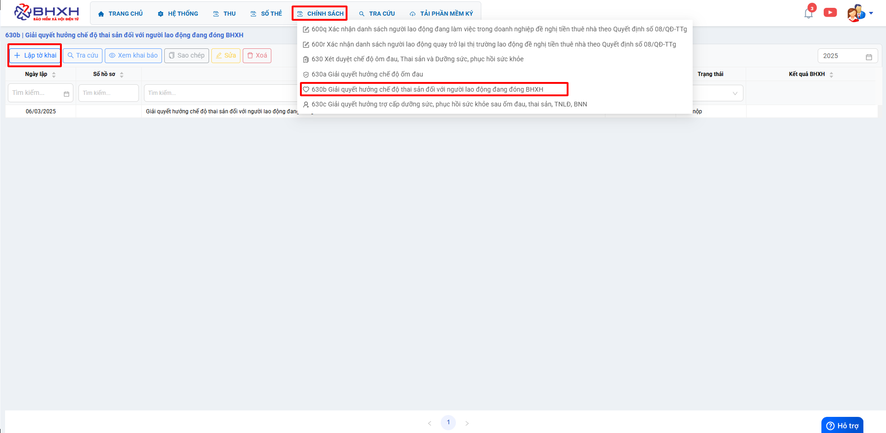
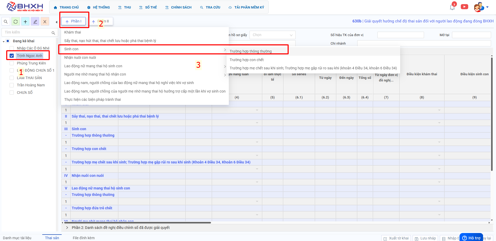
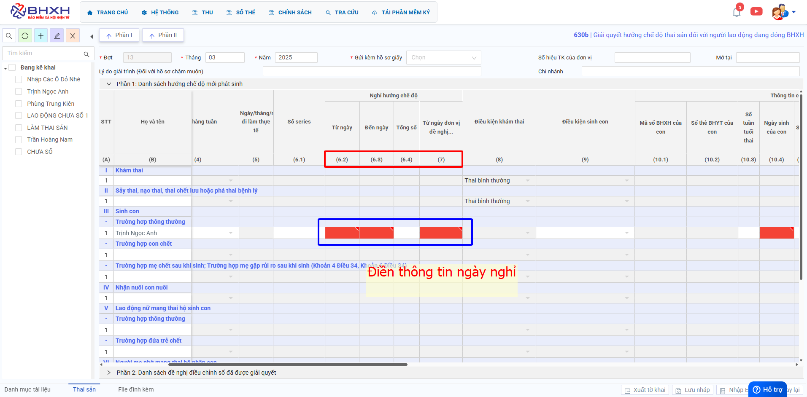
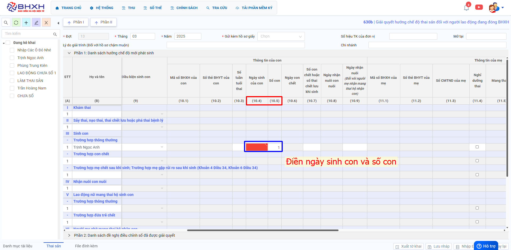
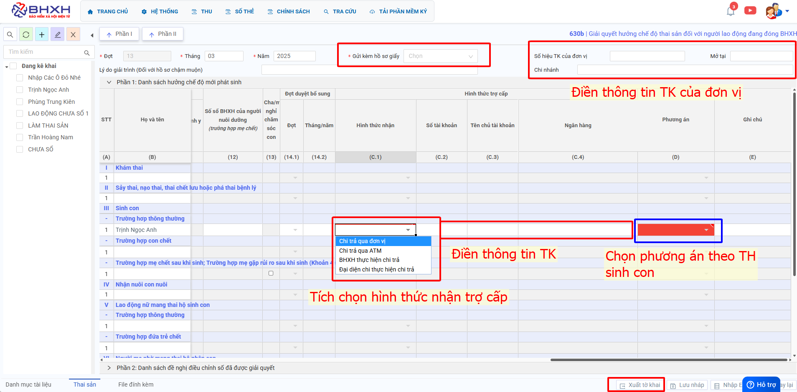
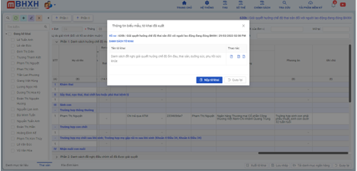

# **Chế độ thai sản 630b**

## **HƯỚNG DẪN KÊ KHAI BÁO CHẾ ĐỘ THAI SẢN TRÊN PHẦN MỀM M-BHXH**

**Thao tác cài đặt và thực hiện như sau**

<iframe style="width: 43rem; height: 380px" src="https://www.youtube.com/embed/dR_VqwkNnis?si=Oi5w27gJsPowj-a3" title="YouTube video player" frameborder="0" allow="accelerometer; autoplay; clipboard-write; encrypted-media; gyroscope; picture-in-picture; web-share" referrerpolicy="strict-origin-when-cross-origin" allowfullscreen></iframe>

**Hướng dẫn sử dụng bằng hình ảnh nếu Quý khách không xem được video**

### Bước 1: Đơn vị Đăng nhập vào phần mềm → chọn “CHÍNH SÁCH” → Hồ sơ 630b “Giải quyết hưởng chế độ thai sản đối với người lao động đang đóng BHXH” → ấn “Lập tờ khai”.

### Bước 2: Bên trong hồ sơ kê khai, đơn vị “tích tên NLĐ” bên phía tay trái chọn “Phần I” mục 3 “Sinh con” >> “Trường hợp thông thường”.

### Bước 3: Điền các trường thông tin yêu cầu trên lưới kê khai.

Cột (6.2): “Từ ngày” Đơn vị điền ngày/tháng/năm đầu tiên NLĐ nghỉ thực tế.
Cột (6.3): “Đến ngày” Đơn vị điền ngày/tháng/năm cuối cùng NLĐ nghỉ thực tế.
Cột (6.4): “Tổng số” Đơn vị điền tổng số ngày NLĐ nghỉ việc trong kỳ đề nghị giải quyết ( bao gồm cả ngày nghỉ hàng tuần và nghỉ lễ).
Cột (7): “Từ ngày đơn vị đề nghị hưởng” Đơn vị điền ngày/tháng/năm đầu tiên đơn vị đề nghị cho NLĐ nghỉ hưởng.

Cột (10.4): “Ngày sinh của con” Đơn vị điền ngày/tháng/năm NLĐ sinh con.
Cột (10.5): “Số con” Đơn vị điền số con được sinh trong kỳ được giải quyết.

Cột (C.1) Hình thức nhận: Đơn vị tích chọn:

- Nếu chọn **“Chi trả qua đơn vị”** thì trên cùng màn hình ô **Số hiệu tài khoản** đơn vị điền số tài khoản của đơn vị **Mở Tại** Ngân hàng…**Chi Nhánh**… điền thêm (C.2) (C.3) (C.4)
- Nếu Tích chọn **“Chi trả qua ATM”** thì đơn vị điền số tài khoản của người lao động vào cột (C.2), (C.3), (C.4). Để trống thống tin ô số hiệu tài khoản đơn vị ở trên cùng màn hình.
  Cột (D): “Phương án” Đơn vị tích chọn phương án tùy theo trường hợp sinh con của người lao động.

Đơn vị Kê khai điền hết thông tin yêu cầu xong ấn **“Xuất Tờ khai"** và đơn vị cắm **“Chữ kí số”** ấn **“Nộp tờ khai”**

???+ Warning "Lưu ý"

    Hộp tờ khai thành công đơn vị gửi kèm theo luôn **“hồ sơ giấy”** lên cơ quan bảo hiểm bằng đường bưu điện. Để bảo hiểm nhận được hồ sơ điện tử và hồ sơ giấy cùng lúc để giải quyết.

Trên đây là các bước thực hiện báo chế độ ốm đau thông thường trên phần mềm M-BHXH

!!! info "Xin chân thành cảm ơn Quý khách hàng đã tin dùng sản phẩm của M-Invoice"

    Có bất kỳ vướng mắc nào trong quá trình sử dụng hãy liên hệ với M-Invoice tại mục Hỗ trợ kỹ thuật góc phải bên dưới màn hình hoặc gọi tổng đài kỹ thuật của M-Invoice (1900.955.557 Nhánh 2)

