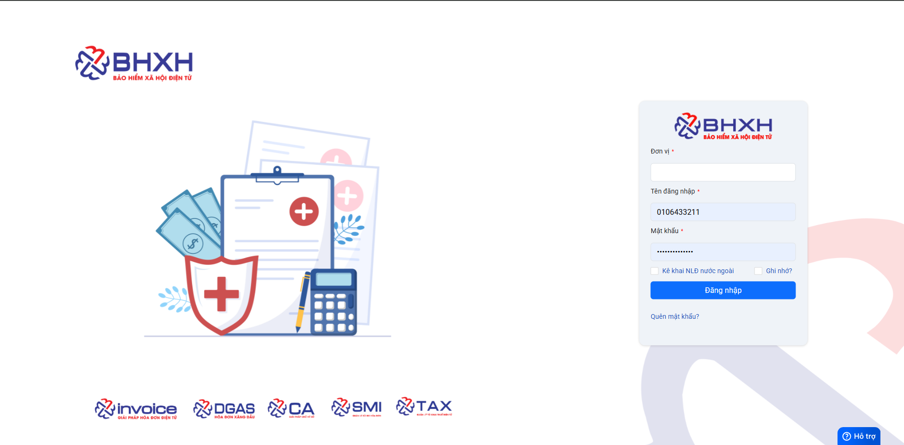
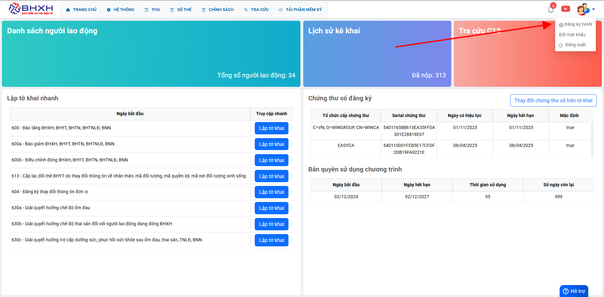
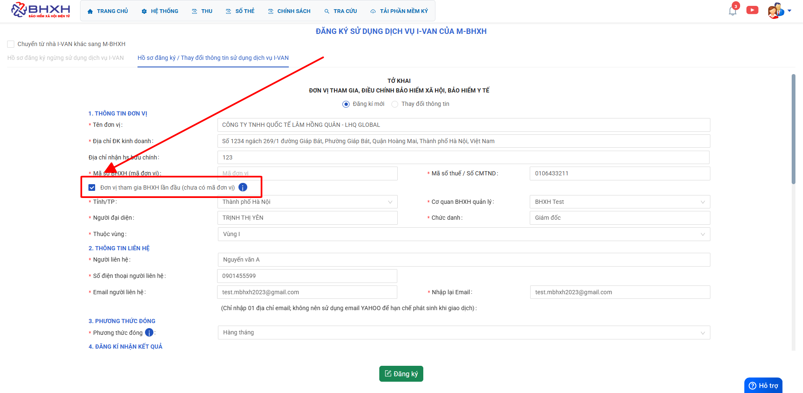
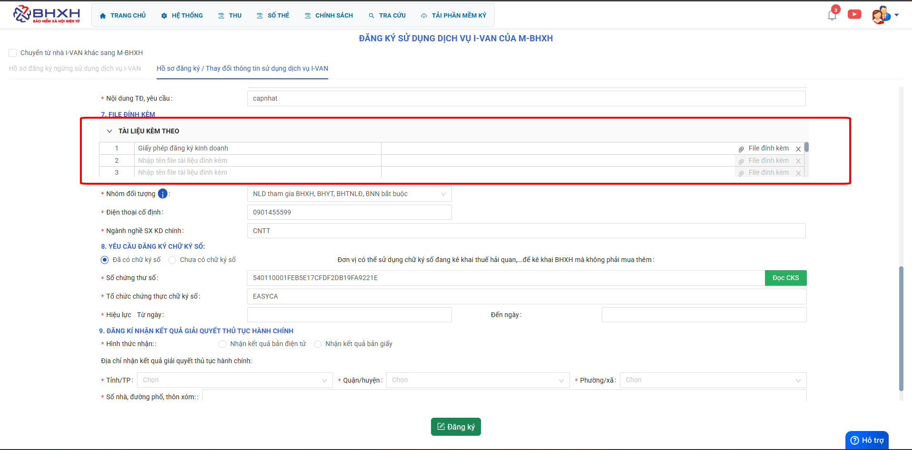
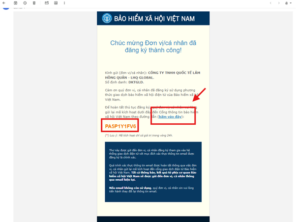
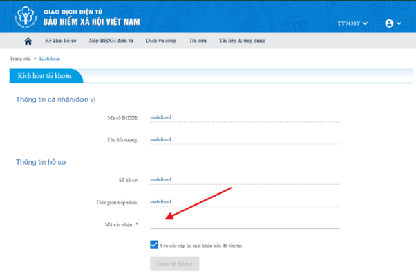

# **Đăng ký tạo tài khoản và hướng dẫn kê khai**

## **1. Hướng dẫn đăng ký tạo tài khoản**

**1.1. Link kiểm tra và tạo tài khoản BHXH**

<a href="https://admin.minvoice.com.vn/#!/app/SICustomer:0=WIN00105" target="_blank" rel="noopener noreferrer">Tạo tài khoản BHXH</a>

**1.2. Link đăng nhập BHXH**

<a href="https://qlbh.mbhxh.com.vn/dashboard" target="_blank" rel="noopener noreferrer">Đăng nhập BHXH</a>

## **2. Hướng dẫn kê khai BHXH**

???+ Warning "Lưu ý"

    Tài khoản tiếp nhận từ phía kinh doanh, nếu thực hiện tạo hộ tài khoản hay đồng bộ tài khoản từ 1.0 sang 2.0 thì ghi rõ vào phần ghi chú trong CRM để nắm rõ thời hạn cũ và thông tin hỗ trợ

**2.1. Hỗ trợ đăng ký I -Van**

2.1.1 : Đơn vị đăng ký mới chưa có mã BHXH

### Bước 1: Thực hiện đăng nhập tài khoản:

### Bước 2: Tại màn hình trang chủ thực hiện chọn đăng ký I-VAN

### Bước 3: Tại giao diện tab "Hồ sơ đăng ký sử dụng dịch vụ I-VAN click chọn Đơn vị tham gia BHXH lần đầu (chưa có mã đơn vị)"

### Bước 4: Thực hiện đính kèm dkkd để nộp hồ sơ

### Bước 5: Mở mail đăng ký thực hiện kích hoạt tài khoản và đợi BHXH cấp mã sau 2 ngày xử lý hồ sơ.

**Bấm vào đây/sau đó copy mã dán vào để kích hoạt cấp mã**

**Dán mã xác nhận để cấp mã BHXH CHO ĐƠN VỊ**

**Đợi BHXH cấp mã sau 2 ngày. Kết quả trả về mail.**

!!! info "Xin chân thành cảm ơn Quý khách hàng đã tin dùng sản phẩm của M-Invoice"

    Có bất kỳ vướng mắc nào trong quá trình sử dụng hãy liên hệ với M-Invoice tại mục Hỗ trợ kỹ thuật góc phải bên dưới màn hình hoặc gọi tổng đài kỹ thuật của M-Invoice (1900.955.557 Nhánh 2)

Last updated on <strong>Mar 10, 2025</strong> by <strong>Trinh Hoai Nhat</strong>

