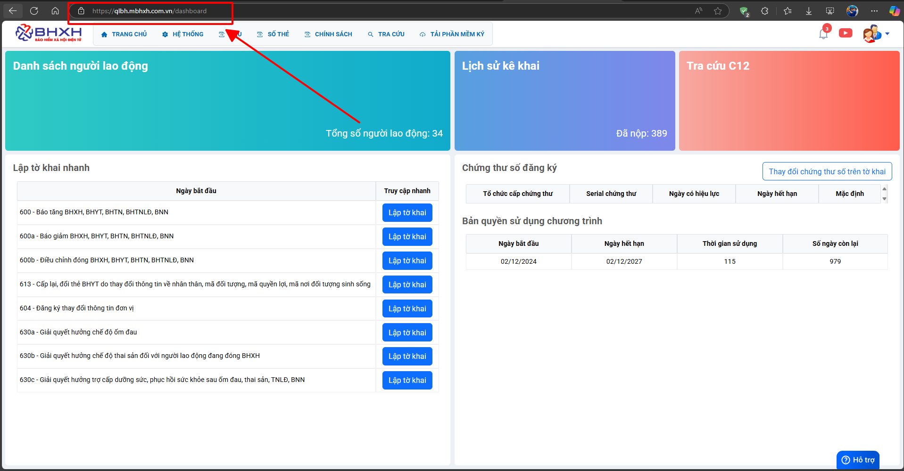
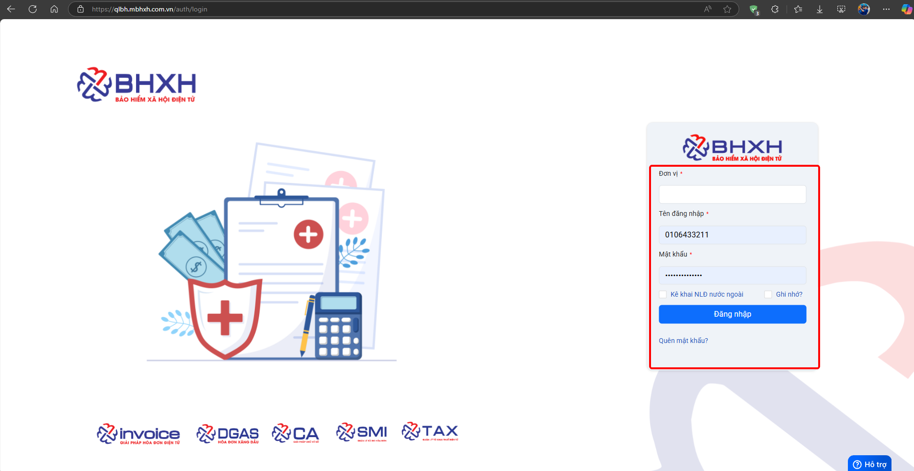
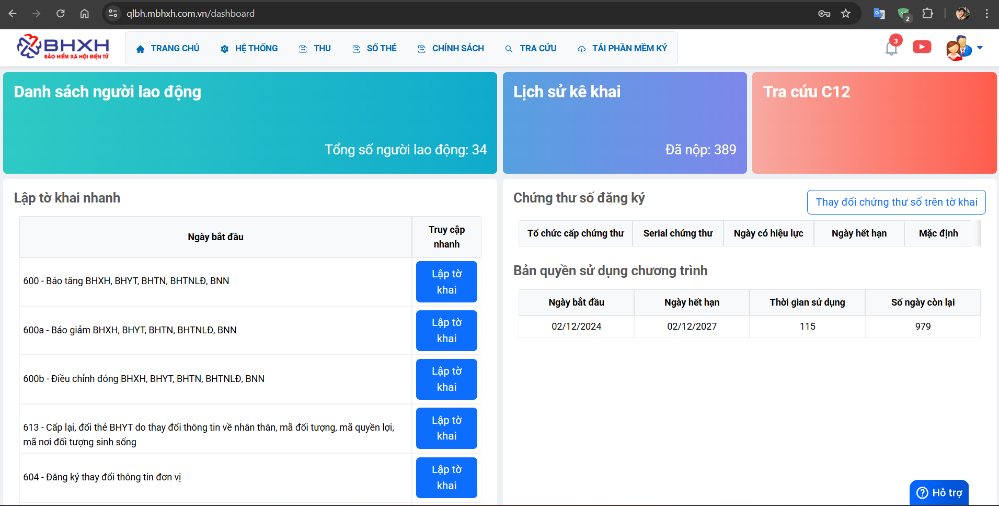
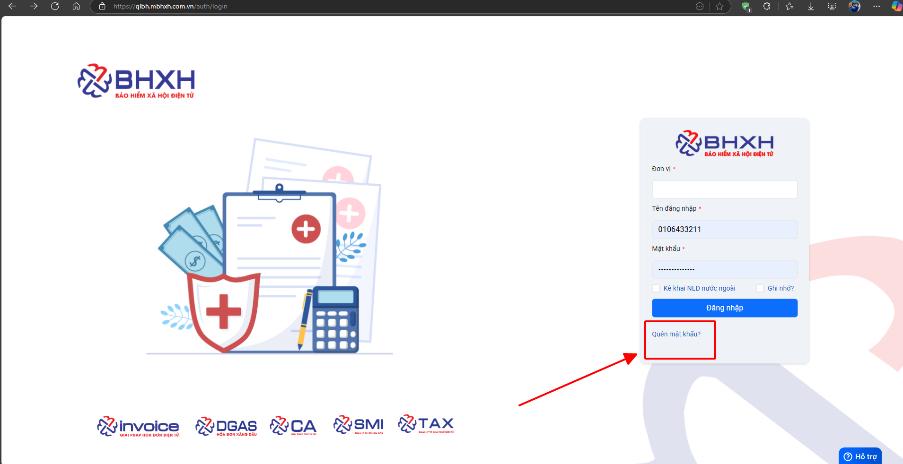

# **Đăng nhập phần mềm mBHXH**

## **Hướng dẫn đăng nhập vào phần mềm bảo hiểm xã hội mBHXH**

### Bước 1: Anh chị chọn vào ô tìm kiếm, gõ đường link : qlbh.mbhxh.com.vn

### Bước 2: Điền các thông tin Đơn vị, Tài khoản và Mật khẩu để có thể đăng nhập vào phần mềm.

### Bước 3: Đăng nhập thành công, hiển thị được Trang chủ của phần mềm

???+ Warning "Lưu ý"

    Nếu anh chị không nhớ mật khẩu, vui lòng làm theo hướng dẫn dưới để lấy lại thông tin đăng nhập

!!! info "Xin chân thành cảm ơn Quý khách hàng đã tin dùng sản phẩm của M-Invoice"

    Có bất kỳ vướng mắc nào trong quá trình sử dụng hãy liên hệ với M-Invoice tại mục Hỗ trợ kỹ thuật góc phải bên dưới màn hình hoặc gọi tổng đài kỹ thuật của M-Invoice (1900.955.557 Nhánh 1)

Last updated on <strong>Mar 27, 2025</strong> by <strong>Trinh Hoai Nhat</strong>

