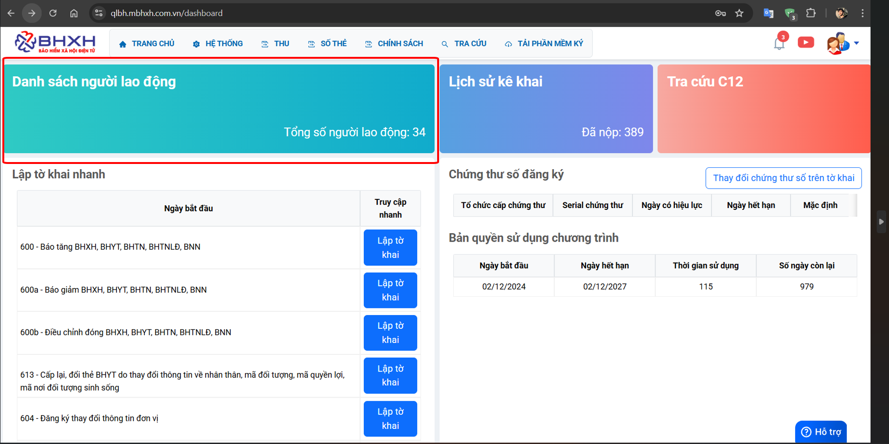

# **Dashboard mBHXH**

Dưới đây là những hướng dẫn thao tác cơ bản trên phần mềm bảo hiểm vô cùng mạch lạc và dễ hiểu.

## **Hướng dẫn truy cập nhanh trên trang chủ Dashboard**

???+ Note "Ghi chú"

    Quý khách có thể truy cập nhanh bằng các chức năng trên màn hình Dashboard một cách nhanh chóng và tiện lợi

## **Tổng quát**

**Số 1: Xem các danh sách người lao động**

**Số 2: Danh sách hồ sơ giao dịch điện tử**

**Số 3: Lập tờ khai các nghiệp vụ bảo hiểm nhanh**

**Số 4: Thông tin cks vào thay đổi nhanh cks trên tờ khai**

**Số 5: Thông tin gói sử dụng mà quý khách hàng đã mua**

???+ info "Xin chân thành cảm ơn quý khách hàng đã tin dùng sản phẩm của M-Invoice"

    Có bất kỳ vướng mắc nào trong quá trình sử dụng hãy liên hệ với M-Invoice tại mục Hỗ trợ kỹ thuật góc phải bên dưới màn hình hoặc gọi tổng đài kỹ thuật của M-Invoice (1900.955.557 Nhánh 1)

