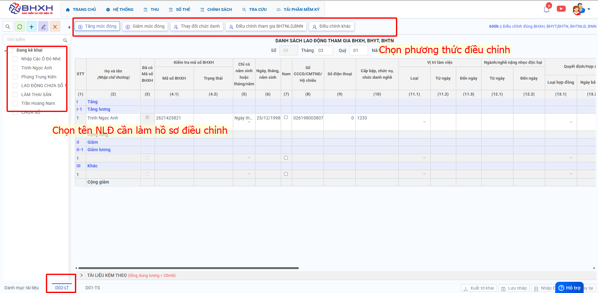

# **Điều chỉnh mức đóng 600b**

## **HƯỚNG DẪN KÊ KHAI BÁO ĐIỀU CHỈNH CHỨC DANH TĂNG MỨC ĐÓNG TRÊN PHẦN MỀM M-BHXH**

**Thao tác cài đặt và thực hiện như sau**

<iframe style="width: 43rem; height: 380px" src="https://www.youtube.com/embed/SixgQQGQT8Y?si=g6RPyR8bY6BWE3hL" title="YouTube video player" frameborder="0" allow="accelerometer; autoplay; clipboard-write; encrypted-media; gyroscope; picture-in-picture; web-share" referrerpolicy="strict-origin-when-cross-origin" allowfullscreen></iframe>

**Hướng dẫn sử dụng bằng hình ảnh nếu Quý khách không xem được video**

### Bước 1: Đơn vị Đăng nhập vào phần mềm → chọn “THU” → Hồ sơ 600b “Điều chỉnh đóng BHXH,BHYT,BHTN,BHTNLĐ,BNN” → ấn “Lập tờ khai”.

Sau khi lập tờ khai chọn sheet **"D02-LT"** để kê khai hồ sơ điều chỉnh.
Chọn tên NLĐ cần làm điều chỉnh ( Có thể chọn cùng lúc nhiều người để làm cùng 1 hồ sơ)

Điền những thông tin thay đổi tương ứng liên quan đến mức đóng mới của NLĐ vào những trường thông tin báo đỏ:"Tiền lương mức đóng mới"

Trường hợp thay đổi chức danh thì sửa lại thông tin: " Cấp bậc, chức vụ, chức danh nghề"

Trường hợp làm hồ sơ điều chỉnh chức danh, mức đóng của những tháng trong quá khứ thì hệ thống phát sinh Bảng kê hồ sơ ( D01-TS)

Bên tab Bảng kê hồ sơ thì điền thông tin ở những ô báo đỏ.
Sau khi kê khai xong thông tin thì ấn **"Xuất tờ khai"**

Sau khi **"Xuất tờ khai"** xong thì cắm chữ ký số ấn **"Nộp tờ khai"**

Trên đây là các bước thực hiện điều chỉnh mức đóng BHXH cho người lao động trên phần mềm M-BHXH

!!! info "Xin chân thành cảm ơn Quý khách hàng đã tin dùng sản phẩm của M-Invoice"

    Có bất kỳ vướng mắc nào trong quá trình sử dụng hãy liên hệ với M-Invoice tại mục Hỗ trợ kỹ thuật góc phải bên dưới màn hình hoặc gọi tổng đài kỹ thuật của M-Invoice (1900.955.557 Nhánh 2)

