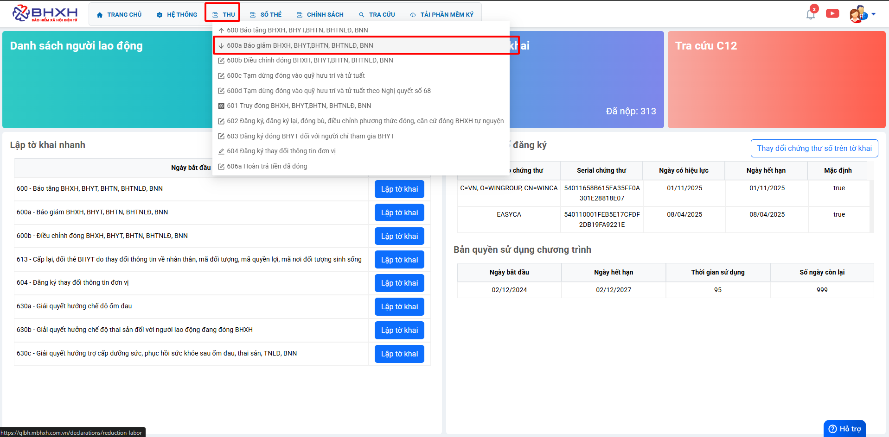
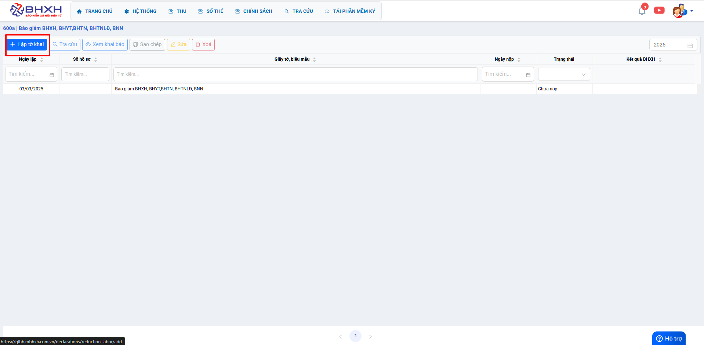
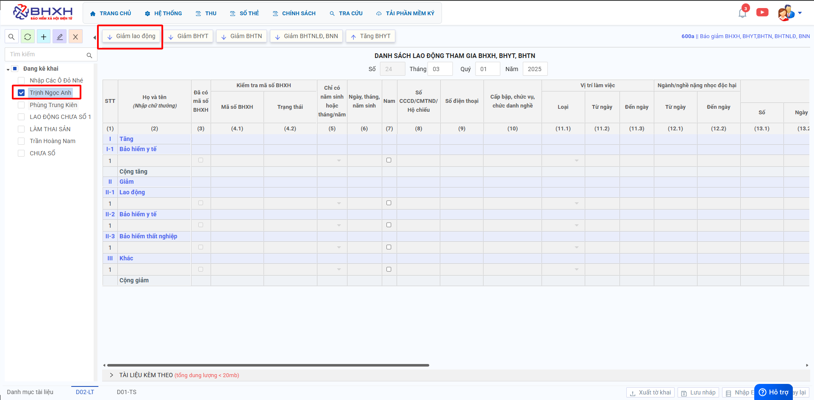
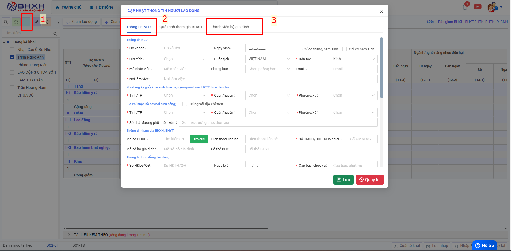
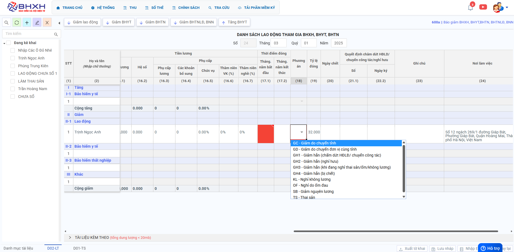
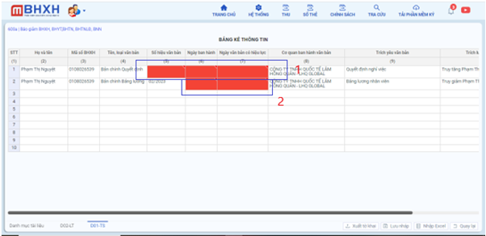
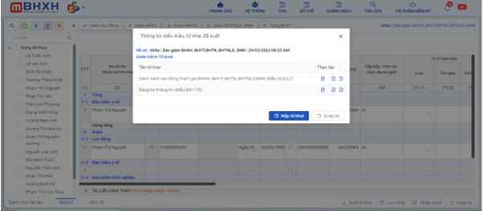

# **Hồ sơ báo giảm 600a**

## **HƯỚNG DẪN KÊ KHAI BÁO GIẢM LAO ĐỘNG TRÊN PHẦN MỀM M-BHXH**

**Thao tác cài đặt và thực hiện như sau**

<iframe style="width: 43rem; height: 380px" src="https://www.youtube.com/embed/shfAT-eTIp4?si=wHHFzO6WIzFhPf_v" title="YouTube video player" frameborder="0" allow="accelerometer; autoplay; clipboard-write; encrypted-media; gyroscope; picture-in-picture; web-share" referrerpolicy="strict-origin-when-cross-origin" allowfullscreen></iframe>

**Hướng dẫn sử dụng bằng hình ảnh nếu Quý khách không xem được video**

### Bước 1: Đơn vị Đăng nhập vào phần mềm → chọn “THU” → Hồ sơ 600a “Báo Giảm BHXH,BHYT,BHTN,BHTNLĐ,BNN” → ấn “Lập tờ khai”.

### Bước 2: Trong hồ sơ kê khai, đơn vị “tích chọn một hoặc nhiều NLĐ” ở danh sách bên trái→ chọn “giảm lao động”.

???+ Warning "Lưu ý"

    Nếu thông tin NLĐ chưa có trong danh sách, Đơn vị ấn vào dấu + bên tay trái góc trên cùng để thêm thông tin → Điền hết thông tin ô dấu sao đỏ → ấn Ghi →Tích tên NLĐ → chọn “giảm lao động”.

???+ Warning "Lưu ý"

    Nếu thông tin NLĐ chưa có trong danh sách, Đơn vị ấn vào dấu + bên tay trái góc trên cùng để thêm thông tin → Điền hết thông tin ô dấu sao đỏ → ấn Lưu →Tích tên NLĐ → chọn “giảm lao động”.

### Bước 3: Trên lưới kê khai (biểu mẫu D02-LT), Đơn vị điền hết thông tin những ô báo đỏ. 3 thời điểm kê khai, báo giảm BHXH

**TRƯỜNG HỢP 1: Đơn vị “báo giảm BHXH trước tháng phát sinh”.**

Đối với phương án GH (giảm hẳn), KL( Không lương),OF ( Nghỉ ốm)… sẽ không bị truy thu BHYT.

**TRƯỜNG HỢP 2: Đơn vị “báo giảm BHXH đúng tháng phát sinh”**

Đối với những Phương án như GH(giảm hẳn), KL(không lương), OF(nghỉ ốm) sẽ phát sinh truy thu BHYT.

**Mục I-1: Bảo hiểm y tế:**

- Cột (17.1) Tháng, năm bắt đầu: là tháng hiện tại kê khai hồ sơ
- Cột (17.2) Tháng, năm kết thúc: là tháng hiện tại kê khai hồ sơ

**Mục II-1: Lao động:**

- Cột (17.2) Tháng, năm kết thúc: là tháng đơn vị bắt đầu muốn báo giảm NLĐ (là tháng hiện tại kê khai hồ sơ)
- Cột (18) Phương Án: Tích chọn phương án giảm tùy theo trường hợp giảm tại đơn vị.
- Cột (21.1) Số: Điền số quyết định chấm dứt HĐLĐ/Chuyển công tác/Nghỉ hưu.
- Cột (22.2) Ngày kí: Điền ngày kí quyết định chấm dứt HĐLĐ/Chuyển công tác/Nghỉ hưu.

**TRƯỜNG HỢP 3: Đơn vị ‘Báo giảm BHXH Chậm muộn từ 1 tháng trở lên”**
Trường hợp này, đơn vị sẽ bị “truy thu BHYT” đến thời điểm hiện tại làm hồ sơ và phát Sinh “bảng kê hồ sơ D01-TS”

**Bảng kê hồ sơ D01-TS:**
**Dòng 1:**

- Cột (4) Tên loại văn bản:
  1, Hồ sơ báo giảm hẳn → kê quyết định chấm dứt HĐLĐ/Chuyển công tác/Nghỉ hưu
  2, Hồ sơ giảm thai sản, nghỉ ốm → kê Giấy khai sinh/giấy chứng sinh của con (thai sản): Giấy ra viện (Ốm đau)
- Cột (5) Số hiệu văn bản: Số hiệu của loại văn bản kê tại cột (5)
- Cột (6) Ngày ban hành:Ngày ban hành văn bản trên
- Cột (7) Ngày có hiệu lực: Ngày có hiệu lực văn bản trên
- Cột (8) Cơ quan ban hành: Cơ quan ban hành văn bản
- Cột (9) Trích yếu văn bản: là Tên loại văn bản
- Cột (10) Trích lược nội dung cần thẩm định: “Truy giảm Nguyễn Thị B,…. Nghỉ từ tháng….”
  Dòng 2:
- Cột (6) Ngày ban hành: Là ngày ban hành bảng lương ( bảng lương tháng báo giảm chậm muộn)
- Cột(7) Ngày văn bản có hiệu lực: Là ngày có hiệu lực bảng lương ( bảng lương tháng báo giảm chậm muộn)

- Đơn vị điền hết thông tin vào những ô dấu báo đỏ trên phần mềm →ấn “Xuất tờ khai
  Đơn vị cắm USB token Ký số vào máy → Ấn **“Nộp tờ khai”** → Chọn Chữ kí số → ấn **“OK”** → nhập **“mã pin Token”** → ấn “ Enter ” → **“Nộp tờ khai thành công”** → Đơn vị chờ nhận kết quả giải quyết qua mail đã đăng kí để theo dõi hồ sơ.

Trên đây là các bước thực hiện báo giảm BHXH cho người lao động trên phần mềm M-BHXH

!!! info "Xin chân thành cảm ơn Quý khách hàng đã tin dùng sản phẩm của M-Invoice"

    Có bất kỳ vướng mắc nào trong quá trình sử dụng hãy liên hệ với M-Invoice tại mục Hỗ trợ kỹ thuật góc phải bên dưới màn hình hoặc gọi tổng đài kỹ thuật của M-Invoice (1900.955.557 Nhánh 2)

