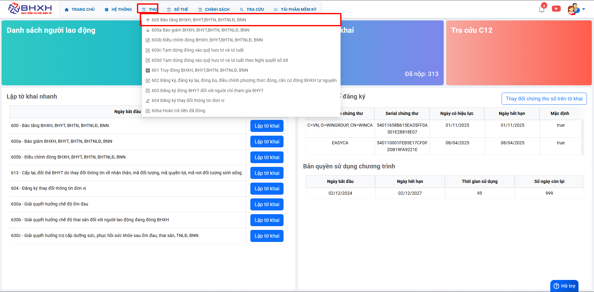
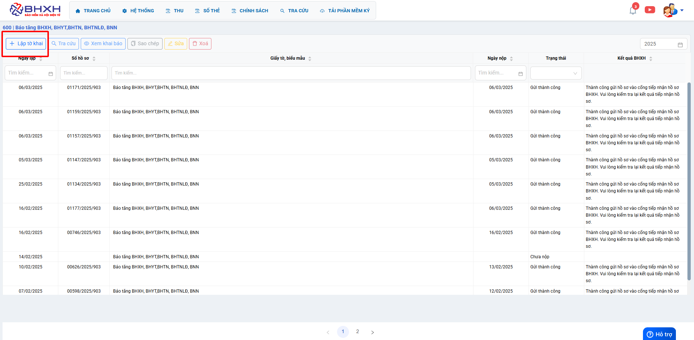
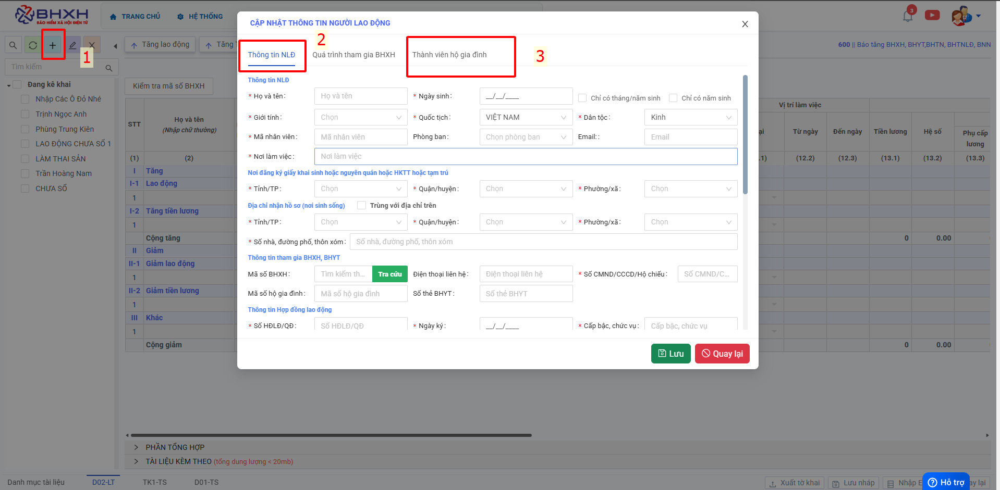
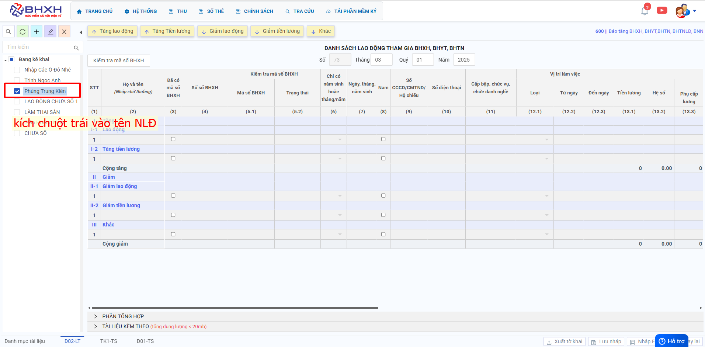
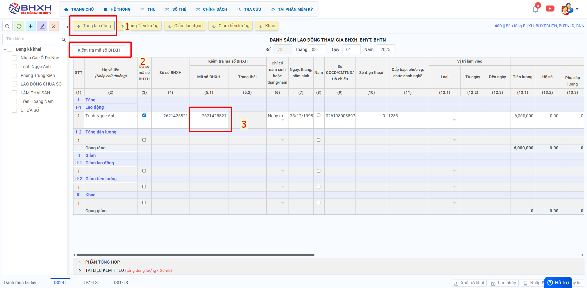
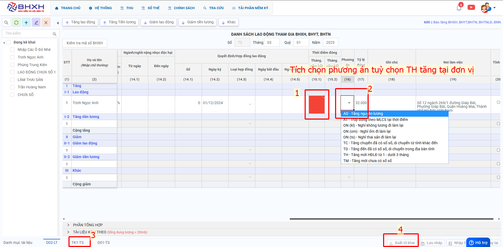
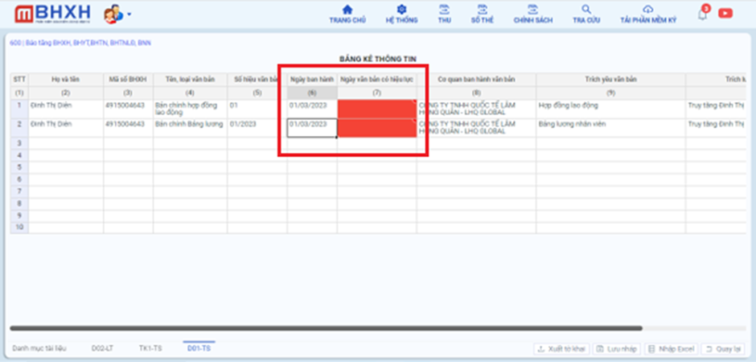

# **Hồ sơ báo tăng 600**

## **HƯỚNG DẪN KÊ KHAI BÁO TĂNG LAO ĐỘNG TRÊN PHẦN MỀM M-BHXH**

**Thao tác cài đặt và thực hiện như sau**

<iframe style="width: 43rem; height: 380px" src="https://www.youtube.com/embed/KITTewMpozI?si=N-d4VaTRh2fApM6L" title="YouTube video player" frameborder="0" allow="accelerometer; autoplay; clipboard-write; encrypted-media; gyroscope; picture-in-picture; web-share" referrerpolicy="strict-origin-when-cross-origin" allowfullscreen></iframe>

**Hướng dẫn sử dụng bằng hình ảnh nếu Quý khách không xem được video**

### Bước 1: Đơn vị Đăng nhập vào phần mềm → chọn “THU” → Hồ sơ 600 “Báo tăng BHXH,BHYT,BHTN,BHTNLĐ,BNN” → ấn “Lập tờ khai”.

### Bước 2: Người lao động chưa có thông tin kê khai trên Phần mềm đơn vị ấn dấu + để thêm thông tin.

**Trên “Cập nhật thông tin người lao động”: Anh/chị điền đầy đủ thông tin vào nhưng ô dấu sao đỏ sau đó ấn “Lưu” để lưu thông tin NLĐ trên phần mềm**

**Sheet Thành Viên Hộ gia đình**: Đơn vị Kê khai đầy đủ thông tin thành viên hộ gia đình có trong sổ hộ khẩu/sổ tạm trú của NLĐ.

### Bước 3: Người lao động sau khi được thêm vào phần mềm sẽ hiển thị danh sách thông tin bên phía trái màn hình

???+ Note "Hướng dẫn"

    Tích chọn tên NLĐ trên danh sách bên trái → Chọn **Báo Tăng lao động** (thông tin NLĐ sẽ chuyển sang lưới kê khai) → Đơn vị ấn **“Kiểm tra mã số BHXH”**
    TH1: Nếu kiểm tra ra mã số BHXH trùng với số sổ BHXH  để lại mã số.
    TH2: Kiểm tra ra mã số **KHÔNG** trùng với số sổ BHXH  “Xóa” mã số BHXH vừa kiểm tra ra đó đi.
    TH3: Nếu người lao động chưa có sổ BHXH mà ấn kiểm tra ra được mã số BHXH → ấn “Xóa” mã số BHXH vừa kiểm tra ra đó đi để hiển thị thông tin Phụ lục thành viên hộ gia đình.

**Cột (15.1) Tháng năm bắt đầu**: Điền tháng đơn vị muốn tăng đóng cho Người lao động

**Cột (16) Phương Án**: Tích chọn phương án tùy theo trường hợp tăng đóng tại đơn vị.

???+ Note "Lưu ý"

    TD: Tăng đến đã có sổ BHXH, di chuyển trong địa bàn tỉnh ( Trước đó Đơn vị đóng BHXH cho NLĐ cùng tỉnh với đơn vị mình đang đóng ).
    TC: Tăng đến đã có sổ BHXH, di chuyển từ tỉnh khác đến ( Trước đó Đơn vị đóng BHXH cho NLĐ khác tỉnh với đơn vị mình đang đóng ).
    **Sheet Thành Viên Hộ gia đình**: Đơn vị Kê khai đầy đủ thông tin thành viên hộ gia đình có trong sổ hộ khẩu của NLĐ.
    Sau khi Điền hết thông tin báo đỏ trên phần mềm chọn  **“Xuất Tờ Khai”**

???+ Warning "Lưu ý"

    Đơn vị làm hồ sơ chậm muộn từ 1 tháng trở lên sẽ phát sinh bảng kê hồ sơ ( Tờ khai D01-TS).
    Dòng 1, Cột (7) Ngày văn bản có hiệu lực: Là ngày hợp đồng lao động có hiệu lực.
    Dòng 2, Ngày ban hành: là ngày kí bảng lương. (tháng muốn đóng BHXH cho NLĐ do báo muộn)
    Ngày văn bản có hiệu lực: Là ngày trả lương nhân viên (tháng muốn đóng BHXH cho NLĐ do báo muộn)

Sau khi Điền hết thông tin báo đỏ trên phần mềm → chọn **“Xuất Tờ Khai”**
Đơn vị cắm USB token Ký số vào máy → Ấn **“Nộp tờ khai”** → Chọn Chữ kí số → ấn “OK” → nhập “mã pin Token” → ấn “Enter” → **“Nộp tờ khai thành công”** → Đơn vị chờ nhận kết quả giải quyết qua mail đã đăng kí để theo dõi hồ sơ.

Trên đây là các bước thực hiện báo tăng BHXH cho người lao động trên phần mềm M-BHXH

!!! info "Xin chân thành cảm ơn Quý khách hàng đã tin dùng sản phẩm của M-Invoice"

    Có bất kỳ vướng mắc nào trong quá trình sử dụng hãy liên hệ với M-Invoice tại mục Hỗ trợ kỹ thuật góc phải bên dưới màn hình hoặc gọi tổng đài kỹ thuật của M-Invoice (1900.955.557 Nhánh 2)

Last updated on <strong>Mar 18, 2025</strong> by <strong>Trinh Hoai Nhat</strong>

