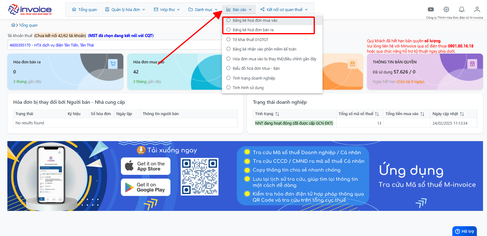
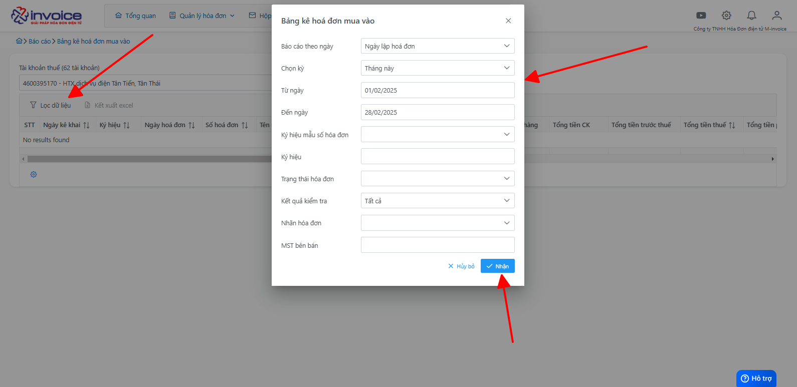
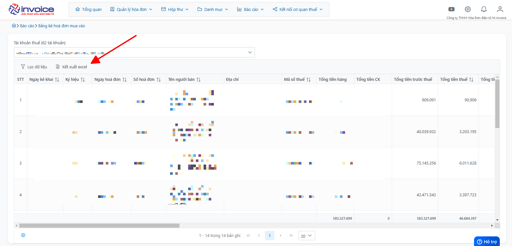

# **Bảng kê hóa đơn mua vào - bán ra**

## **Hướng dẫn xem và kết xuất hóa đơn mua vào - bán ra**

### Bước 1: Click chọn Báo cáo :

Chọn mục báo cáo Bán ra hoặc Mua vào tùy thuộc nhu cầu đang cần sử dụng

### Bước 2: Anh chị bấm vào nút lọc dữ liệu

Tại đây sẽ có các điều kiện để mình có thể lọc, anh chị điền theo ý muốn và click bấm nhận

### Bước 3: Sau khi bấm nhận, phần mềm sẽ hiển thị dữ liệu mà anh chị cần

Nếu cần lưu trữ báo cáo, anh chị click chọn vào Kết xuất excel

!!! info "Xin chân thành cảm ơn Quý khách hàng đã tin dùng sản phẩm của M-Invoice"

    Có bất kỳ vướng mắc nào trong quá trình sử dụng hãy liên hệ với M-Invoice tại mục Hỗ trợ kỹ thuật góc phải bên dưới màn hình hoặc gọi tổng đài kỹ thuật của M-Invoice (1900.955.557 Nhánh 1)

Last updated on <strong>Mar 10, 2025</strong> by <strong>Trinh Hoai Nhat</strong>

