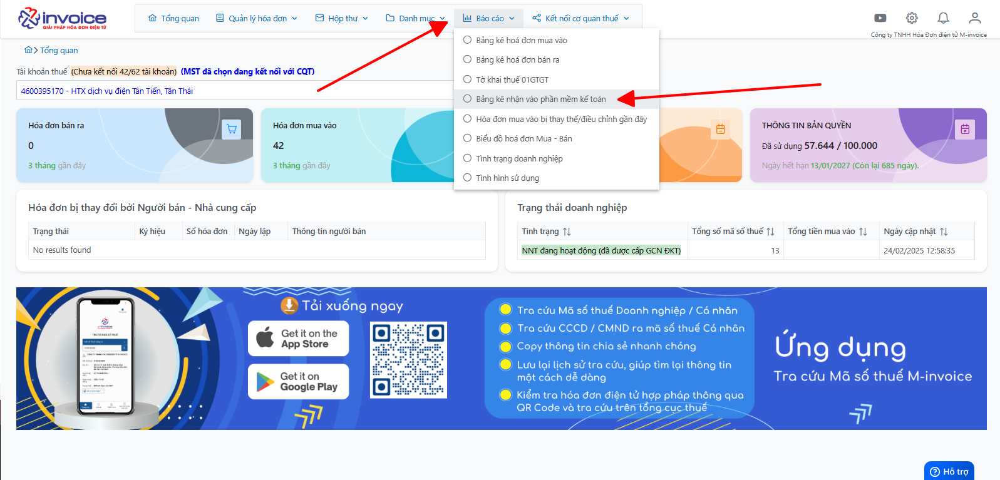
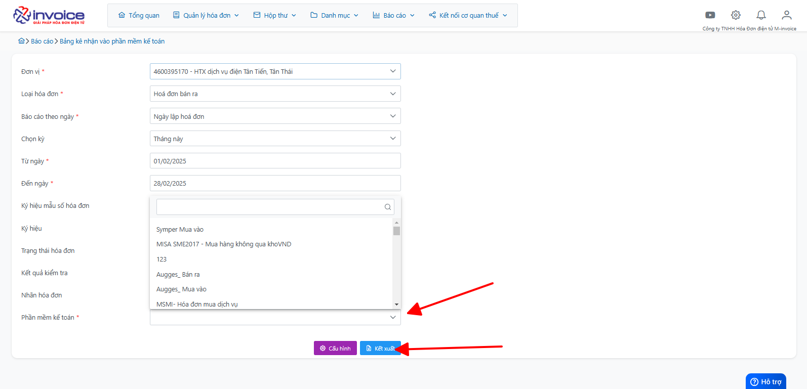

# **Bảng kê nhận nhận vào Phần mềm kế toán**

## **Hướng dẫn xem và kết xuất bảng kê nhận vào PMKT**

### Bước 1: Click chọn Báo cáo :

Chọn mục Bảng kê nhận vào PMKT

### Bước 2: Anh chị bấm vào nút lọc dữ liệu

Tại đây sẽ có các điều kiện để mình có thể lọc, anh chị điền theo ý muốn và click vào Kết xuất

Sau khi bấm vào phần mềm sẽ tự động tải bảng kê về máy cho anh chị.

!!! info "Xin chân thành cảm ơn Quý khách hàng đã tin dùng sản phẩm của M-Invoice"

    Có bất kỳ vướng mắc nào trong quá trình sử dụng hãy liên hệ với M-Invoice tại mục Hỗ trợ kỹ thuật góc phải bên dưới màn hình hoặc gọi tổng đài kỹ thuật của M-Invoice (1900.955.557 Nhánh 1)

