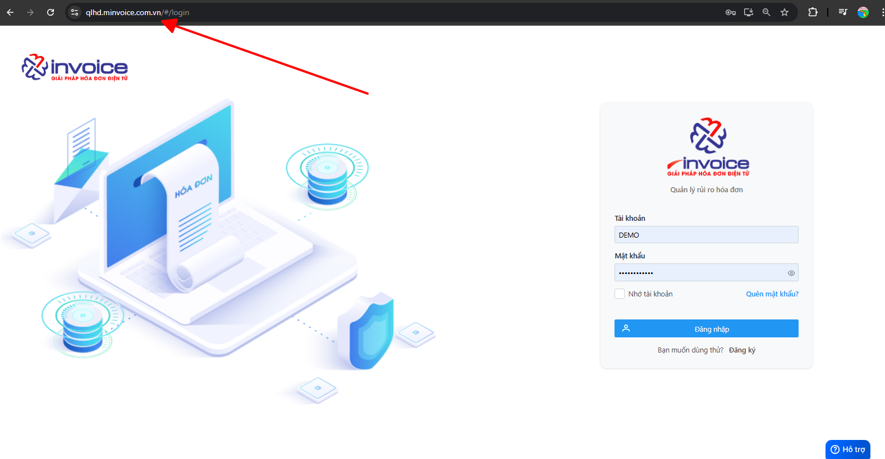
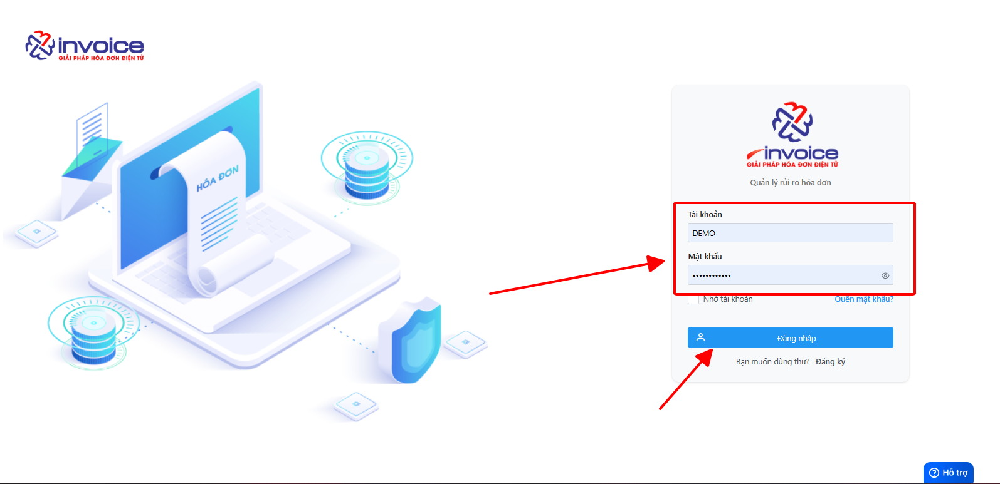

# **Đăng nhập phần mềm mSMI**

## **Hướng dẫn đăng nhập vào phần mềm quản lý hóa đơn mSMI**

### Bước 1: Anh chị chọn vào ô tìm kiếm, gõ đường link : qlhd.minvoice.com.vn

### Bước 2: Điền các thông tin Tài khoản và Mật khẩu để có thể đăng nhập vào phần mềm.

???+ Warning "Lưu ý"
Anh chị được phép nhập sai thông tin 5 lần, sau 5 lần phần mềm sẽ khóa tài khoản trong 5 phút.

### Bước 3: Đăng nhập thành công, hiển thị được Trang chủ của phần mềm

???+ Warning "Lưu ý"
Nếu anh chị không nhớ mật khẩu, vui lòng làm theo [Hướng dẫn](lay-mat-khau.md) để lấy lại thông tin đăng nhập

!!! info "Xin chân thành cảm ơn Quý khách hàng đã tin dùng sản phẩm của M-Invoice"

    Có bất kỳ vướng mắc nào trong quá trình sử dụng hãy liên hệ với M-Invoice tại mục Hỗ trợ kỹ thuật góc phải bên dưới màn hình hoặc gọi tổng đài kỹ thuật của M-Invoice (1900.955.557 Nhánh 1)

Last updated on <strong>Mar 27, 2025</strong> by <strong>truongnl</strong>

