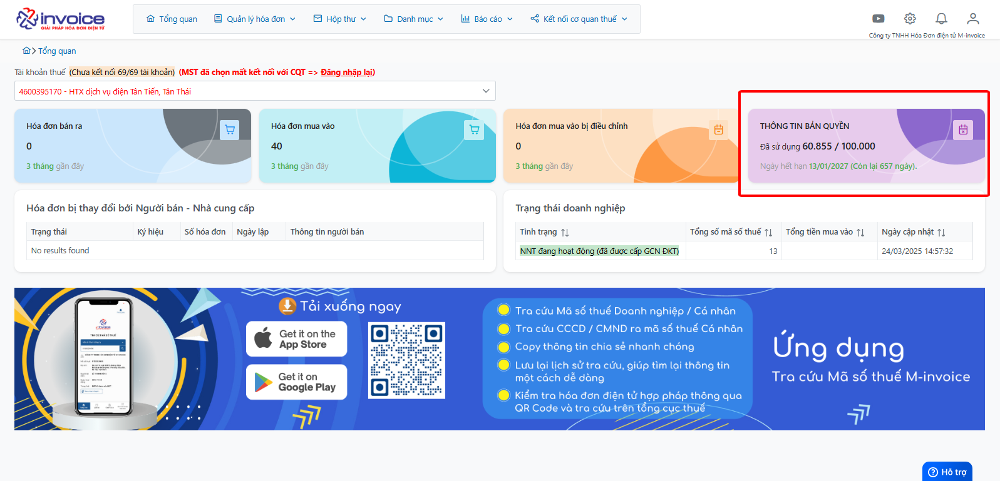

# **Trang chủ phần mềm mSMI**

## **Giới thiệu trang chủ phần mềm quản lý hóa đơn hóa đơn mSMI**

### Các module chức năng của phần mềm

 
### Tổng hợp số liệu các hóa đơn đầu ra đầu vào

 
Anh chị có thể truy cập nhanh vào ký hiệu bằng cách click vào.

### Bản quyền ngày và bản quyền số lượng 

Anh chị có thể click vào mục "Hóa đơn" để kiểm tra số lượng hóa đơn từng ký hiệu hoặc "Bản quyền" để kiểm tra bản quyền số lượng hóa đơn

!!! info "Xin chân thành cảm ơn Quý khách hàng đã tin dùng sản phẩm của M-Invoice"

    Có bất kỳ vướng mắc nào trong quá trình sử dụng hãy liên hệ với M-Invoice tại mục Hỗ trợ kỹ thuật góc phải bên dưới màn hình hoặc gọi tổng đài kỹ thuật của M-Invoice (1900.955.557 Nhánh 1)

