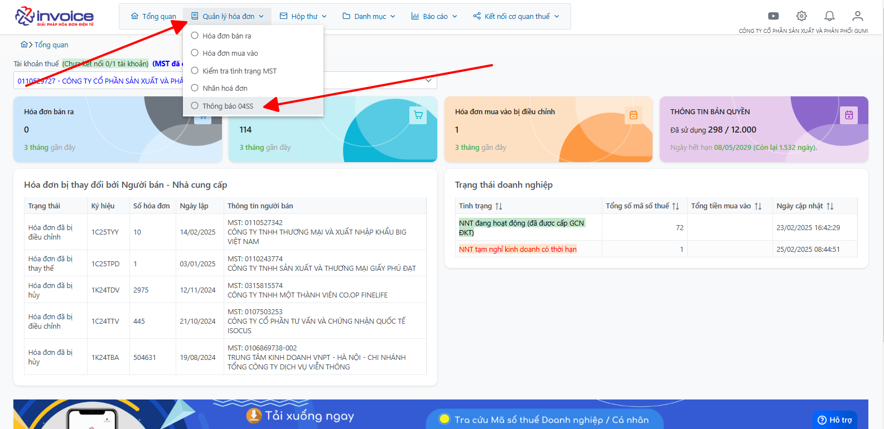
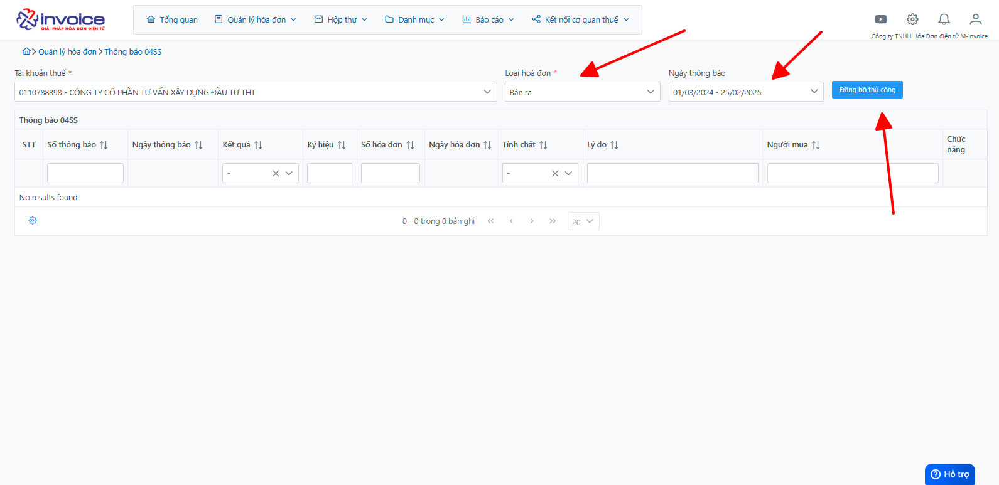

# **Đồng bộ thông báo sai sót 04/SS**

## **Hướng dẫn đồng bộ thông báo sai sót 04/SS**

### Bước 1: Click chọn Quản lý hóa đơn >> Thông báo 04/SS :

### Bước 2: Anh chị điền vào các điều kiện mình muốn đồng bộ, sau đó bấm nút đồng bộ thủ công

Như vậy là mình đã thành công đồng bộ các thông báo sai sót 04/SS của đơn vị.

!!! info "Xin chân thành cảm ơn Quý khách hàng đã tin dùng sản phẩm của M-Invoice"

    Có bất kỳ vướng mắc nào trong quá trình sử dụng hãy liên hệ với M-Invoice tại mục Hỗ trợ kỹ thuật góc phải bên dưới màn hình hoặc gọi tổng đài kỹ thuật của M-Invoice (1900.955.557 Nhánh 1)

