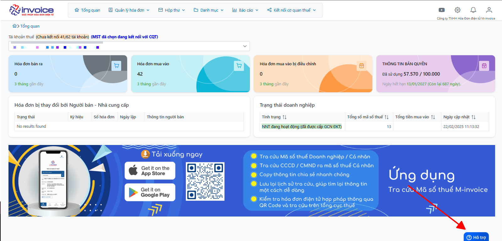

# **Đồng bộ hóa đơn mua vào - bán ra**

## **Hướng dẫn Đồng bộ hóa đơn mua vào - bán ra**

???+ Warning "Lưu ý"
    Để tra cứu được, tài khoản anh chị phải đang có kết nối với Cơ quan thuế

### Bước 1: Click chọn Kết nối cơ quan thuế : 
[![Hình 1]][Hình 1]

[Hình 1]: ../../assets/images/mSMI/msmi_dongBo_1.png

Chọn Danh mục tài khoản

### Bước 2: Anh chị tìm mã số thuế cần đồng bộ và chọn vào nút ba chấm như hình dưới 

[![Hình 2]][Hình 2]

[Hình 2]: ../../assets/images/mSMI/msmi_dongBo_2.png

Chọn đồng bộ hóa đơn ngay

### Bước 3: Giao diện sẽ hiển thị cửa sổ như hình dưới

[![Hình 3]][Hình 3]

[Hình 3]: ../../assets/images/mSMI/msmi_dongBo_3.png

Anh chị chọn vào khoảng thời gian cần đồng bộ tối đa 1 tháng tích chọn hóa đơn mua vào hoặc bán ra.
Chọn Đồng bộ ngay để có thể đồng bộ.

Anh chị cũng có thể chủ động theo dõi lịch sử đồng bọ bằng cách vào lịch sử đồng bộ ở dưới đây: 

[![Hình 4]][Hình 4]

[Hình 4]: ../../assets/images/mSMI/msmi_dongBo_4.png

!!! info "Xin chân thành cảm ơn Quý khách hàng đã tin dùng sản phẩm của M-Invoice"

    Có bất kỳ vướng mắc nào trong quá trình sử dụng hãy liên hệ với M-Invoice tại mục Hỗ trợ kỹ thuật góc phải bên dưới màn hình hoặc gọi tổng đài kỹ thuật của M-Invoice (1900.955.557 Nhánh 1)

