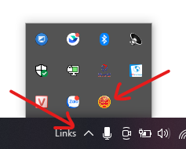
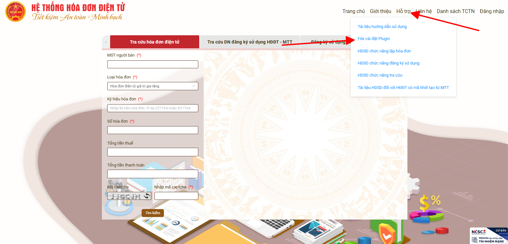
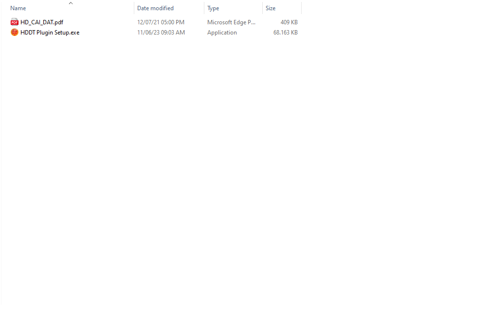
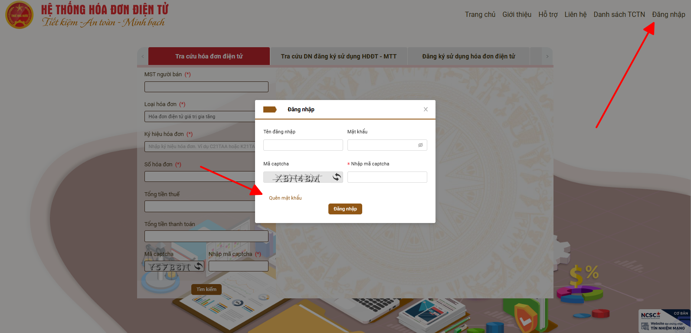
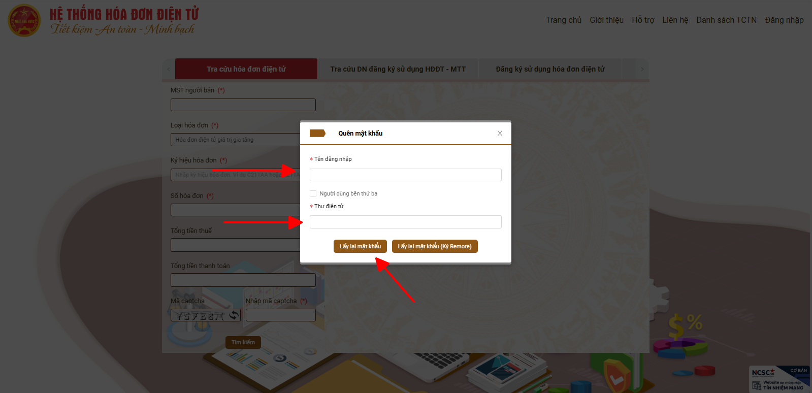
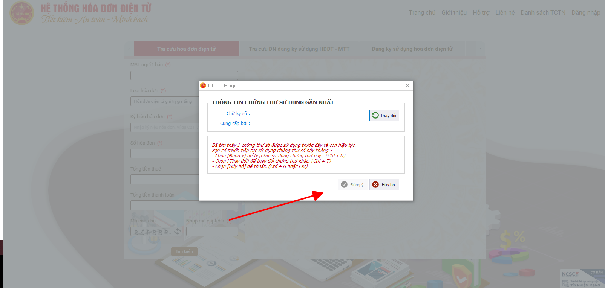

# **Lấy lại mật khẩu trang Hoadondientu bằng chữ ký số**

## **Hướng dẫn lấy lại mật khẩu trang Hoadondientu bằng chữ ký số**

???+ Warning "Lưu ý"

    Để lấy lại được mật khẩu, bắt buộc phải cắm chữ ký số và chữ ký số đã được cài đặt.

Nếu chưa có biểu tượng như hình anh chị truy cập vào trang web bằng đường link : [Hoadondientu](https://hoadondientu.gdt.gov.vn){:target="_blank"} và tải file cài đặt ở đây : 

### Bước 1: Kiểm tra máy tính đã có plugin của Hoadondientu hay chưa như hình dưới :

Nếu chưa có biểu tượng như hình anh chị truy cập vào trang web bằng đường link : [Hoadondientu](https://hoadondientu.gdt.gov.vn){:target="\_blank"} và tải file cài đặt ở đây :

Sau khi tải về và giải nén file cài đặt, anh chị sẽ có 1 file hướng dẫn và 1 file cài đặt.
Anh chỉ mở file và tiến hành cài đặt như hướng dẫn.

### Bước 2: Chọn vào đăng nhập sau đó chọn quên mật khẩu

Sau khi bấm quên mật khẩu, anh chị điền thông tin vào 2 trường hiển thị

Điền xong, anh chị chọn vào "Lấy lại mật khẩu"

### Bước 3: Phần mềm sẽ yêu cầu anh chị chọn chữ ký số, hãy chọn chữ ký chính xác và bấm đồng ý

Ký thành công, trang web sẽ thông báo mật khẩu mới đã được gửi về mail của anh chị.

!!! info "Xin chân thành cảm ơn Quý khách hàng đã tin dùng sản phẩm của M-Invoice"

    Có bất kỳ vướng mắc nào trong quá trình sử dụng hãy liên hệ với M-Invoice tại mục Hỗ trợ kỹ thuật góc phải bên dưới màn hình hoặc gọi tổng đài kỹ thuật của M-Invoice (1900.955.557 Nhánh 1)

