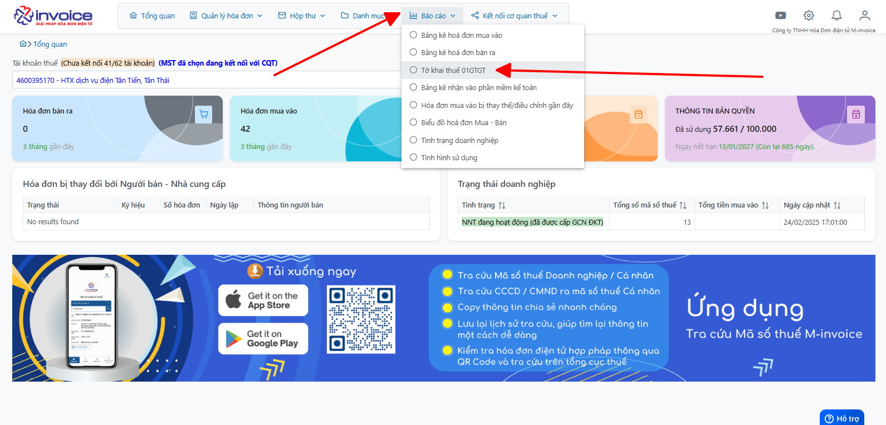
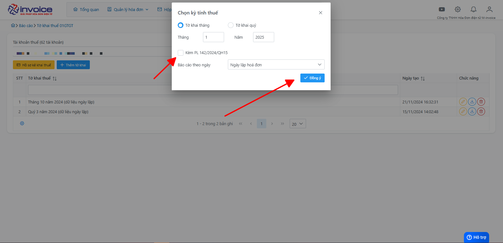
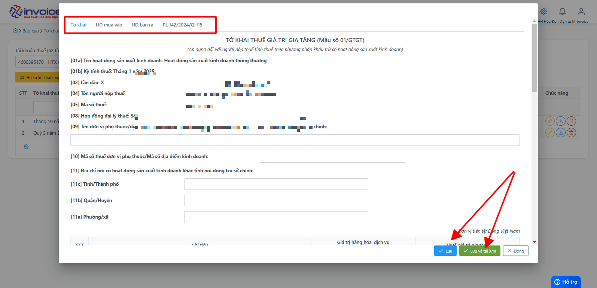
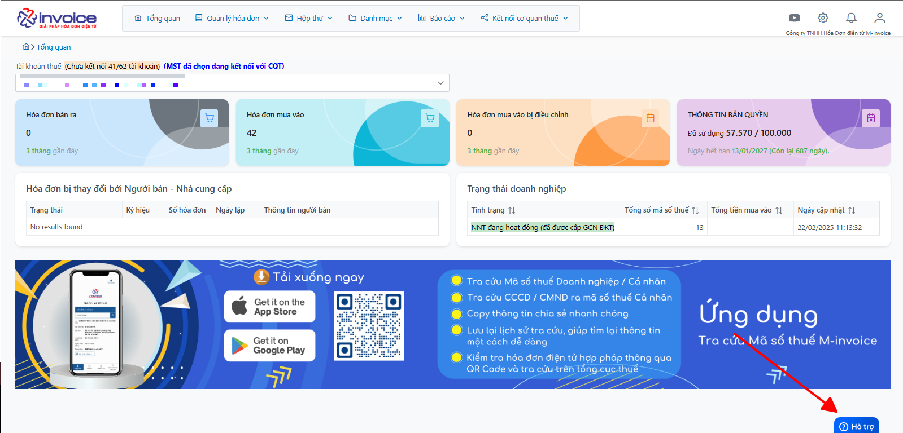

# **Tờ khai thuế 01GTGT**

## **Hướng dẫn tạo và kết xuất Tờ khai thuế 01GTGT**

### Bước 1: Click chọn Báo cáo :

Chọn mục Tờ khai thuế 01GTGT

### Bước 2: Anh chị bấm vào mục Thêm tờ khai sẽ hiển thị giao diện sau

Anh chị chọn các thời gian tờ khai mà mình muốn tạo
Tích vào đính kèm PL142/2024/QH15 nếu anh chị cần và bấm đồng ý

### Bước 3: Màn hình sẽ hiển thị các mục như hình dưới đây

Thông tin tờ khai và các mục hóa đơn bán ra - mua vào cùng với PL142/2024/QH15 sẽ hiển thị trên giao diện
Anh chị kiểm tra thông tin nếu đã đúng thì bấm lưu hoặc lưu và kết xuất.

!!! info "Xin chân thành cảm ơn Quý khách hàng đã tin dùng sản phẩm của M-Invoice"

    Có bất kỳ vướng mắc nào trong quá trình sử dụng hãy liên hệ với M-Invoice tại mục Hỗ trợ kỹ thuật góc phải bên dưới màn hình hoặc gọi tổng đài kỹ thuật của M-Invoice (1900.955.557 Nhánh 1)

