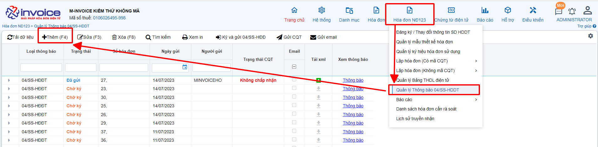
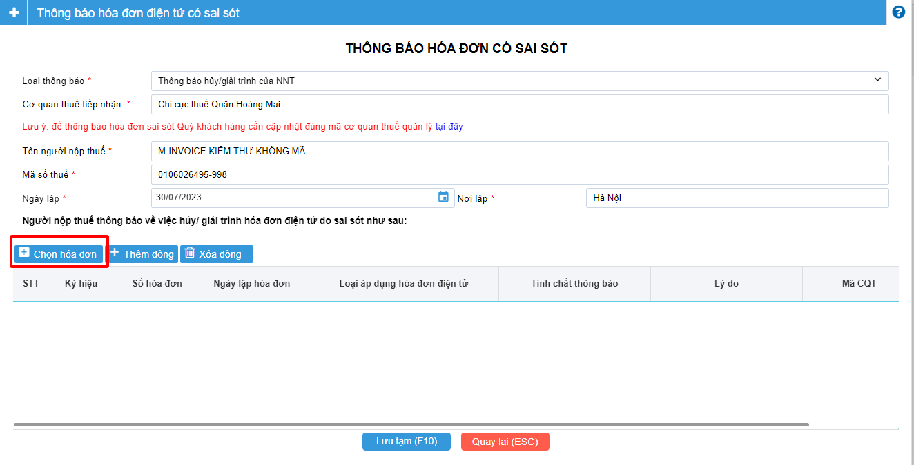
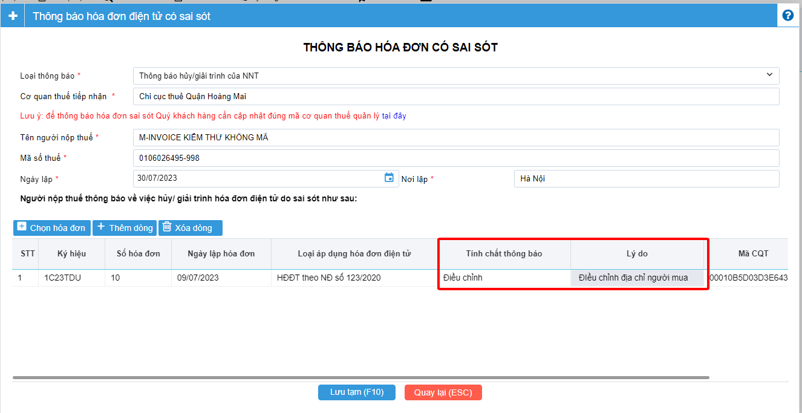
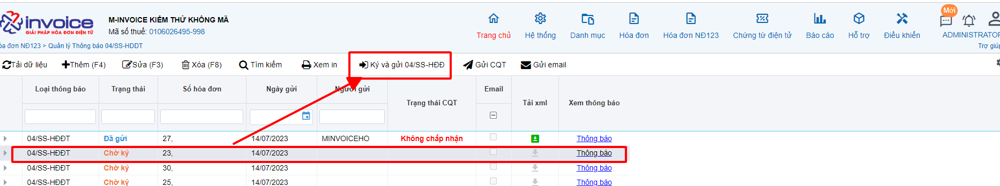

# **Hướng dẫn điều chỉnh hóa đơn theo NĐ123**

!!! note "Người sử dụng có thể sử dụng Nghiệp vụ này trước khi có quyết định thanh kiểm tra của CQT và chỉ được phép sử dụng nghiệp vụ Điều Chỉnh hóa đơn với các điều kiện sau:"

    1.Hóa đơn cần điều chỉnh đã được gửi CQT thành công hoặc hóa đơn đã có mã CQT cấp;

    2.Hóa đơn cần điều ở Trạng thái Gốc (Mới) hoặc Bị điều chỉnh

    3.Nếu điều chỉnh sai lần thứ nhất, điều chỉnh tiếp hóa đơn gốc hay hóa đơn Bị điều chỉnh

!!! warning "Lưu ý"

    Nếu đã lựa chọn nghiệp vụ điều chỉnh thì không được Hủy hóa đơn Điều chỉnh hoặc Bị Điều chỉnh,
    cũng không được Thay thế hóa đơn điều chỉnh. Nghiệp vụ này bắt buộc cần phải lập 04/SS

## Để thực hiện điều chỉnh, bạn làm theo hướng dẫn sau đây

Bạn chọn hóa đơn cần điều chỉnh >> Nghiệp vụ >> Lập hóa đơn điều chỉnh

=== "TH1 : Điều chỉnh khi sai tên công ty, địa chỉ người mua không bị sai phần tiền"

    

    ### Bước 1: Điền lại thông tin đúng ở phần thông tin khách hàng

    ### Bước 2: Ở phần nội dung hàng hóa, tại mục tên hàng hóa sẽ điền nội dung cần điều chỉnh

    VD: Khi sai địa chỉ công ty
    Điều chỉnh địa chỉ của hóa đơn 118 ký hiệu 1C23TZV thành :"Số nhà 16, ngõ 269/1, đường Giáp Bát, Phường Giáp Bát, Quận Hoàng Mai, Thành phố Hà Nội, Việt Nam"

    ### Bước 3: Vì không sai phần tiền nên phần số lượng, đơn giá, tiền thuế , thuế suất sẽ để trống hoặc bằng không

    Ở mục tính chất sẽ chọn tính chất là : Ghi chú/ diễn giải

=== "TH2 : Điều chỉnh phần tên hàng hóa, đơn vị tính không ảnh hưởng đến phần tiền thanh toán"

    

    ### Bước 1: Điền lại thông tin đúng ở phần thông tin khách hàng

    ### Bước 2: Ở phần nội dung hàng hóa, tại mục tên hàng hóa sẽ ghi lại tên hàng hóa đoặc đơn vị tính cho đúng

    VD: điều chỉnh tên hàng hóa
    Điều chỉnh tên hàng từ "mặt hàng A" sang "mặt hàng B"

    VD: điều chỉnh tên đơn vị tính

    Điều chỉnh đơn vị tính của mặt hàng A từ "Cái" sang "Chiếc"

    ### Bước 3: Vì không sai phần tiền nên phần số lượng, đơn giá, tiền thuế , thuế suất sẽ để trống hoặc bằng không

    Ở mục tính chất sẽ chọn tính chất là : Ghi chú/ diễn giải

=== "TH3 : Điều chỉnh tăng, giảm thuế suất"

    ### Bước 1: Điền lại thông tin đúng ở phần thông tin khách hàng

    ### Bước 2: Tại nội dung dòng 1, bạn sẽ viết giảm toàn bộ tiền (Nhập âm) toàn bộ dòng hàng hàng hóa bị sai sót

    VD : Nếu mặt hàng A, số lượng 10, đơn giá 100.000 thuế suất 10%, bạn đang muốn điều chỉnh xuống thuế suất 8%

    Dòng hàng hóa 1: GIảm tiền của mặt hàng sai về bằng 0
    Ở phần nội dung : Điều chỉnh giảm giá trị của mặt hàng A

    Số lượng : -10

    Đơn giá : 100.000
    Thuế suất : 10%

    Dòng hàng hóa 2 : Tăng lại tiền của mặt hàng sai về đúng giá trị

    Ở phần nội dung : Điều chỉnh tăng giá trị của mặt hàng A

    Số lượng : 10

    Đơn giá : 100.000

    Thuế suất : 8%

=== "TH4 : Điều chỉnh số lượng, đơn giá, thành tiền"

    Tương tự trường hợp 3

    !!! warning "Lưu ý"

        Hóa đơn điều chỉnh không cần thiết phải lập mẫu 04/ss-HDDT,
        nhưng nếu chi cục thuế hay khách hàng yêu cầu lập, thì sau đây là cách lập

    ### Bước 1: Chọn vào phần hóa đơn NĐ123 >> Quản lý Thông báo 04/SS-HDDT

    

    ### Bước 2: Nhấn vào chọn hóa đơn

    

    ### Bước 3: Chọn hóa đơn Bị điều chỉnh

    

        1, Chọn ký hiệu cần tìm kiếm
        2. Nhấn tìm kiếm
        3. Chọn hóa đơn Bị điều chỉnh
        4. Nhấn Nhấn (F10)

    ### Bước 4: Chọn tính chất thông báo và điền lý do

    

    ở mục tính chất thông báo chọn : Điều chỉnh
    ở mục lý do : Bạn ghi rõ lý là điều chỉnh cái gì
    Sau khi điền xong bạn nhấn Lưu tạm (F10)

    ### Bước 5: Ký gửi 04ss

    

    Chọn tờ 04ss vừa lập và nhấn Ký gửi 04ss-HDDT

    Nếu thành công ở mục trạng thái CQT sẽ trả về là Chấp nhận còn không là sẽ trả về là không chấp nhận

!!! info "Xin chân thành cảm ơn Quý khách hàng đã tin dùng sản phẩm của M-Invoice"

    Có bất kỳ vướng mắc nào trong quá trình sử dụng hãy liên hệ với M-Invoice tại mục Hỗ trợ kỹ thuật góc phải bên dưới màn hình hoặc gọi tổng đài kỹ thuật của M-Invoice (1900.955.557 Nhánh 1)

