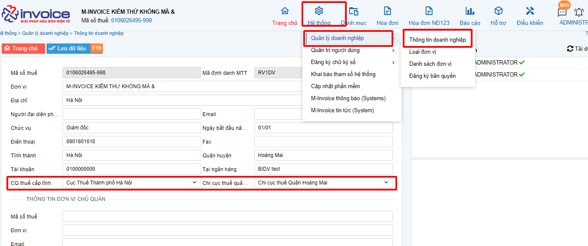
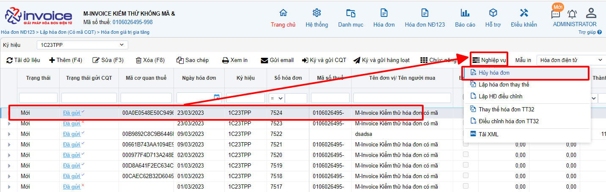
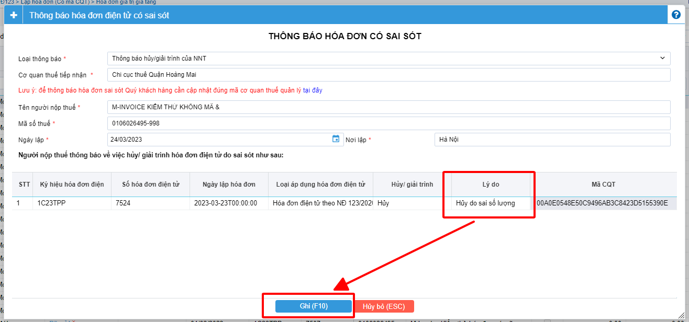
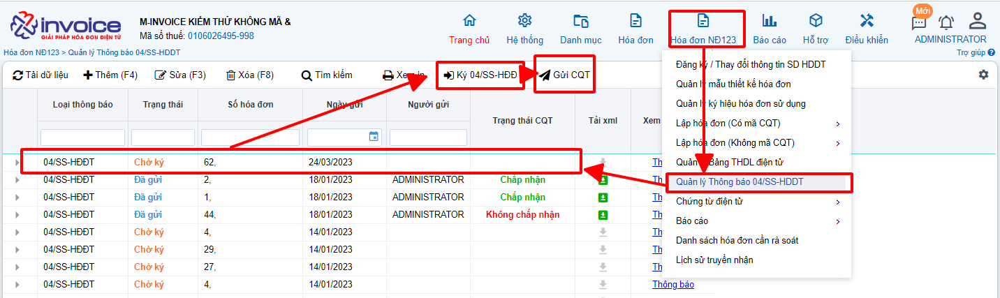

# **Hướng dẫn hủy hóa đơn theo NĐ123**

!!! note "Người sử dụng có thể sử dụng Nghiệp vụ này trước khi có quyết định thanh kiểm tra của CQT và chỉ được phép sử dụng nghiệp vụ Hủy hóa đơn với các điều kiện sau:"

    1. Hóa đơn cần hủy đã được gửi CQT thành công hoặc hóa đơn đã có mã CQT cấp;
    2. Hóa đơn cần hủy ở Trạng thái Gốc (Mới)

!!! warning "Lưu ý"

    Nếu đã lựa chọn nghiệp vụ hủy thì không được điều chỉnh hoặc thay thế hóa đơn đã bị hủy.
    Nghiệp vụ này bắt buộc phải lập 04/SS

<iframe style="width: 43rem; height: 380px" 
    src="https://www.youtube.com/embed/WSA0CrIhZFM" 
    frameborder="0" allowfullscreen>
</iframe>

### Bước 1: Kiểm tra trong phần hệ thống đã điền cơ quan thuế cấp tình và chi cục thuế quản lý hay chưa

Truy cập vào phần Hệ thống >> Quản lý doanh nghiệp >> Thông tin doanh nghiệp
Nếu chưa điền bạn sẽ phải điền vào và sau đó nhấn lưu lại

### Bước 2: Quay trở lại phần mềm, chọn hóa đơn cần hủy, chọn nghiệp vụ chọn hủy hóa đơn

### Bước 3 : Sau khi nhấn hủy phần mềm sẽ tự động sinh ra 1 form để lập mẫu 04ss

Các bạn chỉ cần kiểm tra lại thông tin, sau đó điền vào phần lý do
Khi nhập lý do xong hãy nhấn phím tab để pm lưu lại được mục lý do, sau đó nhấn Ghi(F10)

### Bước 4 : Ký gửi 04ss thông báo sai sót đến CQT

Trên pm truy cập vào phần Hóa đơn NĐ123 >> quản lý thông báo 04/SS-HDDT
Chọn tờ 04ss vừa mới lập ở bước trên nhấn Ký 04/SS - HDDT , sau khi ký xong nhấn gửi CQT

Ở mục trạng thái CQT, nếu cơ quan thuế đồng ý về việc hủy hóa đơn thì phần trạng thái sẽ chuyển về chấp nhận và ngược lại

!!! info "Xin chân thành cảm ơn Quý khách hàng đã tin dùng sản phẩm của M-Invoice"

    Có bất kỳ vướng mắc nào trong quá trình sử dụng hãy liên hệ với M-Invoice tại mục Hỗ trợ kỹ thuật góc phải bên dưới màn hình hoặc gọi tổng đài kỹ thuật của M-Invoice (1900.955.557 Nhánh 1)

