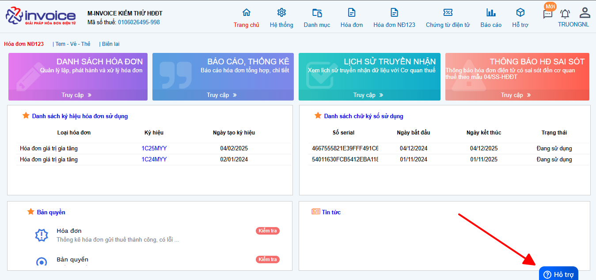

# **Hướng dẫn thay thế hóa đơn theo NĐ123**

!!! note "Người sử dụng có thể sử dụng Nghiệp vụ này trước khi có quyết định thanh kiểm tra của CQT và chỉ được phép sử dụng nghiệp vụ Thay thế hóa đơn với các điều kiện sau:"

    1. Hóa đơn cần thay thế đã được gửi CQT thành công hoặc hóa đơn đã có mã CQT cấp;
    2. Hóa đơn cần thay thế ở Trạng thái Gốc (Mới) hoặc Thay thế

!!! warning "Lưu ý"

    Nếu đã lựa chọn nghiệp vụ thay thế thì không được Hủy hóa đơn Thay thế hoặc Bị Thay thế,
    cũng không được điều chỉnh hóa đơn thay thế. Nghiệp vụ này không cần phải lập 04/SS

<iframe style="width: 43rem; height: 380px"
    src="https://www.youtube.com/embed/7ELjnoRQmVA" 
    frameborder="0" allowfullscreen>
</iframe>

### Bước 1: Chọn hóa đơn cần làm thay thế chọn phần Nghiệp vụ chọn lập hóa đơn thay thế

[![Hình 1]][Hình 1]

[Hình 1]: ../../assets/images/invoice1/1.0_thayThe_1.png

### Bước 2: Điền lại phần chi tiết hóa đơn như 1 tờ hóa đơn mới

[![Hình 2]][Hình 2]

[Hình 2]: ../../assets/images/invoice1/1.0_thayThe_2.png

Nếu hóa đơn có nhiều dòng hàng hóa, bạn cũng có thể cọn copy dòng hàng hóa cũ sang bằng cách nhấn vào Chọn hàng hóa

[![Hình 3]][Hình 3]

[Hình 3]: ../../assets/images/invoice1/1.0_thayThe_3.png

### Bước 3 : Sau khi nhập xong bạn tiến hành lưu lại và ký gửi CQT 1 cách bình thường

[![Hình 4]][Hình 4]

[Hình 4]: ../../assets/images/invoice1/1.0_thayThe_4.png

Lúc này hóa đơn cũ sẽ chuyển thành hóa đơn bị thay thế và sẽ coi như 1 hóa đơn hủy, còn hóa đơn mới vừa tạo sẽ trở thành hóa đơn thay thế. Người sử dụng có thể Ký và gửi hóa đơn đã được lập Thay thế như một hóa đơn thông thường.

!!! info "Xin chân thành cảm ơn Quý khách hàng đã tin dùng sản phẩm của M-Invoice"

    Có bất kỳ vướng mắc nào trong quá trình sử dụng hãy liên hệ với M-Invoice tại mục Hỗ trợ kỹ thuật góc phải bên dưới màn hình hoặc gọi tổng đài kỹ thuật của M-Invoice (1900.955.557 Nhánh 1)

