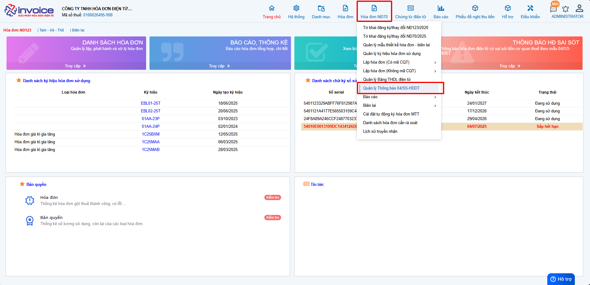
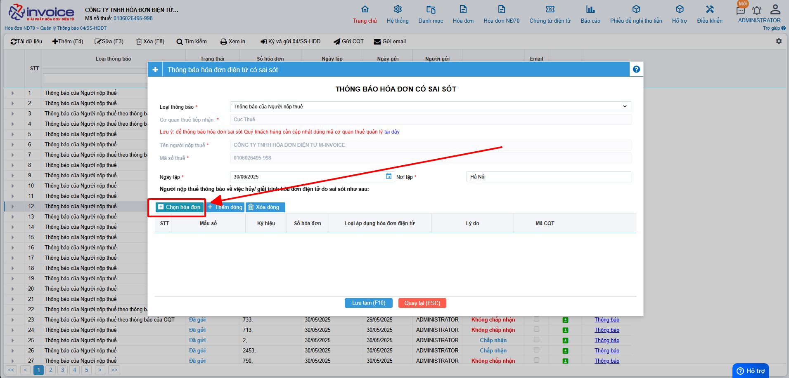

# **Hướng dẫn hủy hóa đơn theo NĐ123**

!!! note "Người sử dụng có thể sử dụng Giải trình hóa đơn đối với các trường hợp sai sót dưới đây:"

    - Hóa đơn cần Giải trình đã được gửi CQT thành công hoặc hóa đơn đã có mã CQT cấp.

    - Hóa đơn sai sót thuộc các trường hợp : Sai tên, địa chỉ người mua, không áp dụng cho sai mã số thuế.

!!! warning "Lưu ý"

    Giải trình hóa đơn không làm thay đổi tính chất của hóa đơn.
    Giải trình không giới hạn số lượng và mọi tính chất hóa đơn đều có thể thực hiện giải trình.

<iframe style="width: 43rem; height: 380px"
    src="https://www.youtube.com/embed/THGtf-CWDAM" 
    frameborder="0" allowfullscreen>
</iframe>

### Bước 1: Anh chị truy cập vào Hóa đơn NĐ 123 >> Quản lý thông báo 04/ss

Anh chị bấm thêm để hiển thị form thêm 04/ss

### Bước 2: Trên form anh chị chọn vào button chọn hóa đơn

Sau khi click vào chọn hóa đơn, giao diện lọc hóa đơn cần làm giải trình sẽ hiển thị:

- Anh chị lọc các điều kiện liên quan tới hóa đơn mình cần và bấm vào tìm kiếm.
- Sau khi đã tìm được hóa đơn cần lập, anh chị tích vào ô trống đầu dòng để chọn và bấm lưu.

### Bước 3 : Sau khi nhấn Lưu phần mềm sẽ tự động sinh ra 1 form để lập mẫu 04ss

Các bạn chỉ cần kiểm tra lại thông tin, chọn tính chất thông báo là "Giải trình", sau đó điền vào phần lý do
Khi nhập lý do xong hãy nhấn phím tab để phần mềm lưu lại được mục lý do, sau đó nhấn Ghi(F10)

### Bước 4 : Ký gửi 04ss thông báo sai sót đến CQT

Sau khi bấm lưu, phần mềm sẽ thông báo ký gửi 04ss lên CQT, anh chị bấm đồng ý

Ở mục trạng thái CQT, nếu cơ quan thuế đồng ý về việc hủy hóa đơn thì phần trạng thái sẽ chuyển về chấp nhận và ngược lại

!!! info "Xin chân thành cảm ơn Quý khách hàng đã tin dùng sản phẩm của M-Invoice"

    Có bất kỳ vướng mắc nào trong quá trình sử dụng hãy liên hệ với M-Invoice tại mục Hỗ trợ kỹ thuật góc phải bên dưới màn hình hoặc gọi tổng đài kỹ thuật của M-Invoice (1900.955.557 Nhánh 1)

