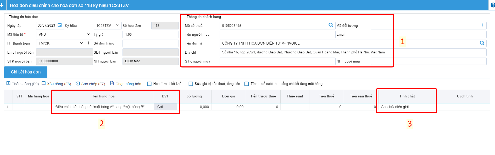
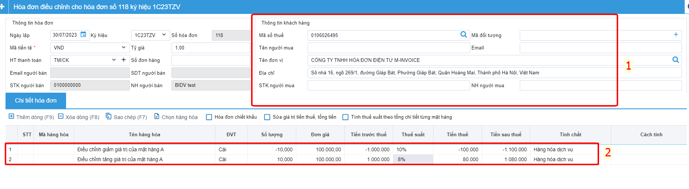

# **Hướng dẫn điều chỉnh hóa đơn theo NĐ123**

<!-- [^1]:
    In 2016, Material for MkDocs started out as a simple theme for MkDocs, but
    over the course of several years, it's now much more than that – with the
    many built-in plugins, settings, and countless customization abilities,
    Material for MkDocs is now one of the simplest and most powerful frameworks
    for creating documentation for your project.

[MkDocs]: https://www.mkdocs.org
[pip]: #with-pip
[docker]: #with-docker -->

!!! note "Người sử dụng có thể sử dụng Nghiệp vụ này trước khi có quyết định thanh kiểm tra của CQT và chỉ được phép sử dụng nghiệp vụ Điều Chỉnh hóa đơn với các điều kiện sau:"
    1.Hóa đơn cần điều chỉnh đã được gửi CQT thành công hoặc hóa đơn đã có mã CQT cấp;

    2.Hóa đơn cần điều ở Trạng thái Gốc (Mới) hoặc Bị điều chỉnh

    3.Nếu điều chỉnh sai lần thứ nhất, điều chỉnh tiếp hóa đơn gốc hay hóa đơn Bị điều chỉnh

!!! warning "Lưu ý"  
        Nếu đã lựa chọn nghiệp vụ điều chỉnh thì không được Hủy hóa đơn Điều chỉnh hoặc Bị Điều chỉnh, 
        cũng không được Thay thế hóa đơn điều chỉnh. Nghiệp vụ này bắt buộc cần phải lập 04/SS


## Để thực hiện điều chỉnh, bạn làm theo hướng dẫn sau đây


Bạn chọn hóa đơn cần điều chỉnh >> Nghiệp vụ >> Lập hóa đơn điều chỉnh

## TH1 : Điều chỉnh khi sai tên công ty, địa chỉ người mua không bị sai phần tiền 



### Bước 1: Điền lại thông tin đúng ở phần thông tin khách hàng 

### Bước 2: Ở phần nội dung hàng hóa, tại mục tên hàng hóa sẽ điền nội dung cần điều chỉnh

VD: Khi sai địa chỉ công ty 
Điều chỉnh địa chỉ của hóa đơn 118 ký hiệu 1C23TZV thành :"Số nhà 16, ngõ 269/1, đường Giáp Bát, Phường Giáp Bát, Quận Hoàng Mai, Thành phố Hà Nội, Việt Nam"

### Bước 3: Vì không sai phần tiền nên phần số lượng, đơn giá, tiền thuế , thuế suất sẽ để trống hoặc bằng không

Ở mục tính chất sẽ chọn tính chất là : Ghi chú/ diễn giải

## TH2 : Điều chỉnh phần tên hàng hóa, đơn vị tính không ảnh hưởng đến phần tiền thanh toán 



### Bước 1: Điền lại thông tin đúng ở phần thông tin khách hàng

### Bước 2: Ở phần nội dung hàng hóa, tại mục tên hàng hóa sẽ ghi lại tên hàng hóa đoặc đơn vị tính cho đúng

VD: điều chỉnh tên hàng hóa
Điều chỉnh tên hàng từ "mặt hàng A" sang "mặt hàng B"

VD: điều chỉnh tên đơn vị tính

Điều chỉnh đơn vị tính của mặt hàng A từ "Cái" sang "Chiếc"

### Bước 3: Vì không sai phần tiền nên phần số lượng, đơn giá, tiền thuế , thuế suất sẽ để trống hoặc bằng không

Ở mục tính chất sẽ chọn tính chất là : Ghi chú/ diễn giải

## TH3 : Điều chỉnh tăng, giảm thuế suất

### Bước 1: Điền lại thông tin đúng ở phần thông tin khách hàng

### Bước 2: Tại nội dung dòng 1, bạn sẽ viết giảm toàn bộ tiền (Nhập âm) toàn bộ dòng hàng hàng hóa bị sai sót
VD : Nếu mặt hàng A, số lượng 10, đơn giá 100.000 thuế suất 10%, bạn đang muốn điều chỉnh xuống thuế suất 8%

Dòng hàng hóa 1: GIảm tiền của mặt hàng sai về bằng 0
Ở phần nội dung : Điều chỉnh giảm giá trị của mặt hàng A

Số lượng : -10

Đơn giá : 100.000
Thuế suất : 10%

Dòng hàng hóa 2 : Tăng lại tiền của mặt hàng sai về đúng giá trị

Ở phần nội dung : Điều chỉnh tăng giá trị của mặt hàng A

Số lượng : 10

Đơn giá : 100.000

Thuế suất : 8%

## TH4 : Điều chỉnh số lượng, đơn giá, thành tiền
Tương tự trường hợp 3


!!! warning "Lưu ý"  
        Hóa đơn điều chỉnh không cần thiết phải lập mẫu 04/ss-HDDT, 
        nhưng nếu chi cục thuế hay khách hàng yêu cầu lập, thì sau đây là cách lập

### Bước 1: Chọn vào phần hóa đơn NĐ123 >> Quản lý Thông báo 04/SS-HDDT


### Bước 2: Nhấn vào chọn hóa đơn


### Bước 3: Chọn hóa đơn Bị điều chỉnh


    1, Chọn ký hiệu cần tìm kiếm
    2. Nhấn tìm kiếm 
    3. Chọn hóa đơn Bị điều chỉnh
    4. Nhấn Nhấn (F10)

### Bước 4: Chọn tính chất thông báo và điền lý do


ở mục tính chất thông báo chọn : Điều chỉnh
ở mục lý do : Bạn ghi rõ lý là điều chỉnh cái gì
Sau khi điền xong bạn nhấn Lưu tạm (F10)

### Bước 5: Ký gửi 04ss


Chọn tờ 04ss vừa lập và nhấn Ký gửi 04ss-HDDT

Nếu thành công ở mục trạng thái CQT sẽ trả về là Chấp nhận còn không là sẽ trả về là không chấp nhận

!!! info "Xin chân thành cảm ơn Quý khách hàng đã tin dùng sản phẩm của M-Invoice"
    Có bất kỳ vướng mắc nào trong quá trình sử dụng hãy liên hệ với M-Invoice tại mục Hỗ trợ kỹ thuật góc phải bên dưới màn hình hoặc gọi tổng đài kỹ thuật của M-Invoice (1900.955.557 Nhánh 1)


<!-- === "Latest"

    ``` sh
    pip install mkdocs-material
    ```

=== "9.x"

    ``` sh
    pip install mkdocs-material=="9.*" # (1)!
    ```

    1.  Material for MkDocs uses [semantic versioning][^2], which is why it's a
        good idea to limit upgrades to the current major version.

        This will make sure that you don't accidentally [upgrade to the next
        major version], which may include breaking changes that silently corrupt
        your site. Additionally, you can use `pip freeze` to create a lockfile,
        so builds are reproducible at all times:

        ```
        pip freeze > requirements.txt
        ```

        Now, the lockfile can be used for installation:

        ```
        pip install -r requirements.txt
        ```

[^2]:
    Note that improvements of existing features are sometimes released as
    patch releases, like for example improved rendering of content tabs, as
    they're not considered to be new features.

This will automatically install compatible versions of all dependencies:
[MkDocs], [Markdown], [Pygments] and [Python Markdown Extensions]. Material for
MkDocs always strives to support the latest versions, so there's no need to
install those packages separately.

---

:fontawesome-brands-youtube:{ style="color: #EE0F0F" }
**[How to set up Material for MkDocs]** by @james-willett – :octicons-clock-24:
27m – Learn how to create and host a documentation site using Material for
MkDocs on GitHub Pages in a step-by-step guide.

[How to set up Material for MkDocs]: https://www.youtube.com/watch?v=xlABhbnNrfI

---

!!! tip

    If you don't have prior experience with Python, we recommend reading
    [Using Python's pip to Manage Your Projects' Dependencies], which is a
    really good introduction on the mechanics of Python package management and
    helps you troubleshoot if you run into errors.

[Python package]: https://pypi.org/project/mkdocs-material/
[virtual environment]: https://realpython.com/what-is-pip/#using-pip-in-a-python-virtual-environment
[semantic versioning]: https://semver.org/
[upgrade to the next major version]: upgrade.md
[Markdown]: https://python-markdown.github.io/
[Pygments]: https://pygments.org/
[Python Markdown Extensions]: https://facelessuser.github.io/pymdown-extensions/
[Using Python's pip to Manage Your Projects' Dependencies]: https://realpython.com/what-is-pip/

### with docker

The official [Docker image] is a great way to get up and running in a few
minutes, as it comes with all dependencies pre-installed. Open up a terminal
and pull the image with:

=== "Latest"

    ```
    docker pull squidfunk/mkdocs-material
    ```

=== "9.x"

    ```
    docker pull squidfunk/mkdocs-material:9
    ```

The `mkdocs` executable is provided as an entry point and `serve` is the
default command. If you're not familiar with Docker don't worry, we have you
covered in the following sections.

The following plugins are bundled with the Docker image:

- [mkdocs-minify-plugin]
- [mkdocs-redirects]

  [Docker image]: https://hub.docker.com/r/squidfunk/mkdocs-material/
  [mkdocs-minify-plugin]: https://github.com/byrnereese/mkdocs-minify-plugin
  [mkdocs-redirects]: https://github.com/datarobot/mkdocs-redirects

??? question "How to add plugins to the Docker image?"

    Material for MkDocs only bundles selected plugins in order to keep the size
    of the official image small. If the plugin you want to use is not included,
    you can add them easily:

    === "Material for MkDocs"

        Create a `Dockerfile` and extend the official image:

        ``` Dockerfile title="Dockerfile"
        FROM squidfunk/mkdocs-material
        RUN pip install mkdocs-macros-plugin
        RUN pip install mkdocs-glightbox
        ```

    === "Insiders"

        Clone or fork the Insiders repository, and create a file called
        `user-requirements.txt` in the root of the repository. Then, add the
        plugins that should be installed to the file, e.g.:

        ``` txt title="user-requirements.txt"
        mkdocs-macros-plugin
        mkdocs-glightbox
        ```

    Next, build the image with the following command:

    ```
    docker build -t squidfunk/mkdocs-material .
    ```

    The new image will have additional packages installed and can be used
    exactly like the official image.

### with git

Material for MkDocs can be directly used from [GitHub] by cloning the
repository into a subfolder of your project root which might be useful if you
want to use the very latest version:

```
git clone https://github.com/squidfunk/mkdocs-material.git
```

Next, install the theme and its dependencies with:

```
pip install -e mkdocs-material
```

[GitHub]: https://github.com/squidfunk/mkdocs-material -->
