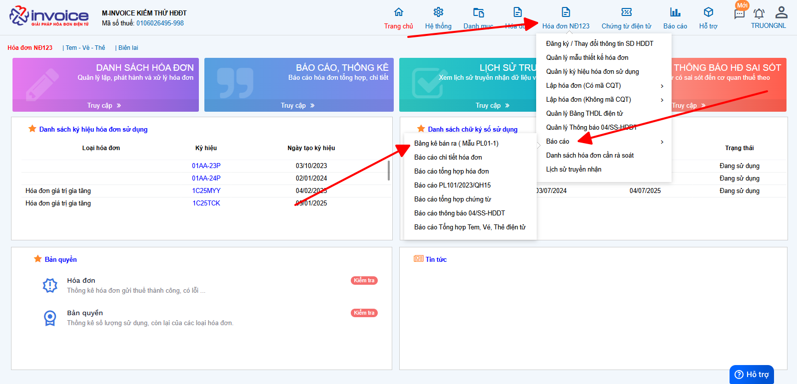
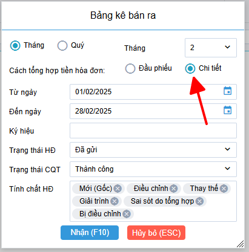
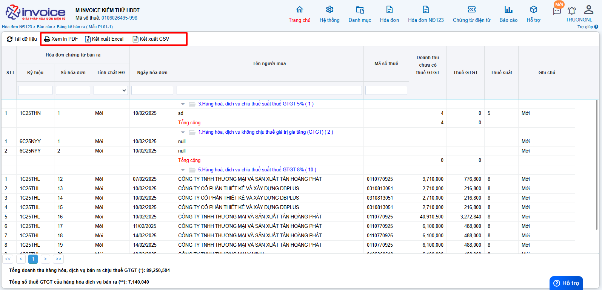

# **Báo cáo bảng kê bán ra PL01 hóa đơn NĐ123**

## **Hướng dẫn xem và tải bảng kê bán ra PL01 hóa đơn NĐ123**

### **Bước 1: Truy cập vào phần Hóa đơn HĐ123 >> Báo cáo >> Bảng kê bán ra (Mẫu PL01-1)**

### **Bước 2: Chọn các điều kiện để lọc báo cáo**

!!! warning "Lưu ý"

    Nếu hóa đơn có nhiều dòng hàng hóa trong 1 hóa đơn, anh chị tích vào mục chi tiết để kết quả được đúng nhất.

### **Bước 3 : Kết xuất báo cáo**

Anh chị có thể sử dụng các chức năng ở hình trên sau khi đã lọc dữ liệu tùy thuộc vào nhu cầu của mình.

???+ info "Xin chân thành cảm ơn quý khách hàng đã tin dùng sản phẩm của M-Invoice"

    Có bất kỳ vướng mắc nào trong quá trình sử dụng hãy liên hệ với M-Invoice tại mục Hỗ trợ kỹ thuật góc phải bên dưới màn hình hoặc gọi tổng đài kỹ thuật của M-Invoice (1900.955.557 Nhánh 1)

