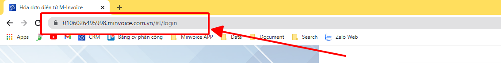
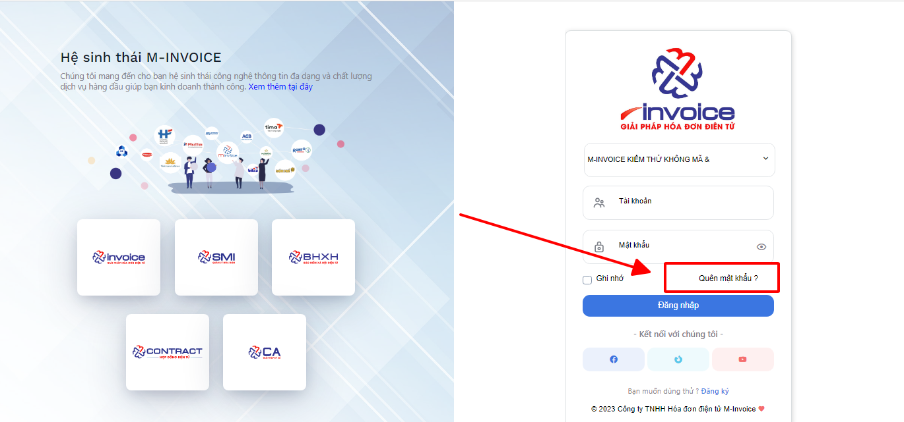
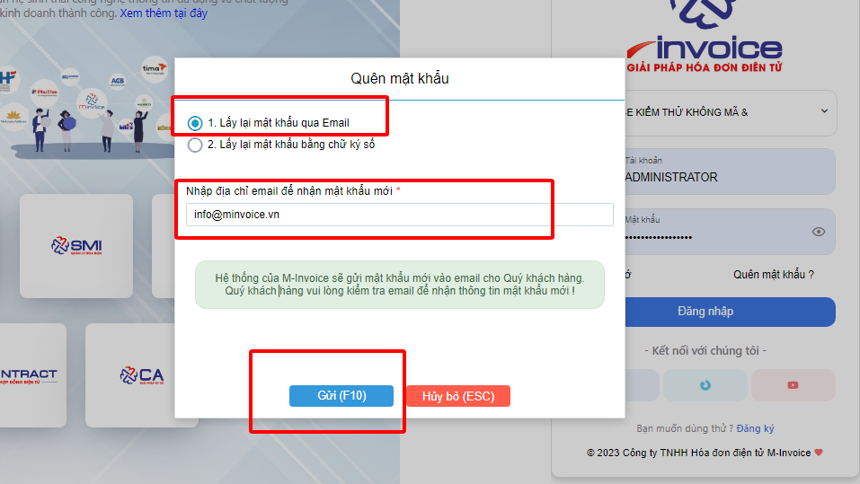
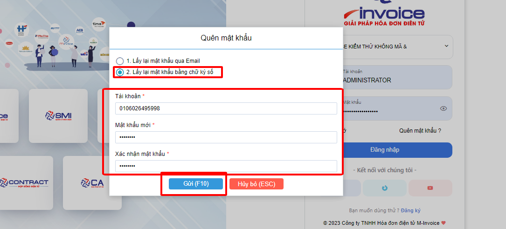

# **Hướng dẫn lấy lại mật khẩu đăng nhập**

### Bước 1: Đảm bảo đúng đường link đăng nhập

Đường link đăng nhập có dạng : MST.minvoice.com.vn
Trong đó MST chính là mã số thuế của doanh nghiệp

### Bước 2: Ở màn hình đăng nhập chọn nút quên mật khẩu để lấy lại mật khẩu

### Bước 3 : Giao diện quên mật khẩu, bạn có thẻ lấy lại mật khẩu qua 2 cách, 1 là Email , 2 bằng chữ ký số

#### 1, Lấy lại mật khẩu qua Email

Bạn nhập đúng địa chỉ Email đã đăng ký với phần mềm, sau đó nhấn Gửi (F10)

Sau đó tài khoản và mật khẩu sẽ tự động được gửi vào Email cho bạn

#### 2, Lấy lại mật khẩu qua Chữ ký số

<iframe style="width: 43rem; height: 380px" 
    src="https://www.youtube.com/embed/AIJm4Xc6Uro" 
    frameborder="0" allowfullscreen>
</iframe>

Hướng dẫn lấy lại mật khẩu bằng hình ảnh nếu Quý khách không xem được Video

Bạn nhập tên tài khoản (Thường sẽ là mã số thuế của doanh nghiệp), và xác nhận lại 2 lần mật khẩu , sau đó nhấn nhận
Để thực hiện chức năng này, bạn bắt buộc phải cài plugin, và dùng đúng chữ ký số đã đăng ký với phần mềm

Nếu bạn chưa cài Plugin có thể cài plugin qua đường dẫn sau đây
[Plugin](https://plugin.minvoice.com.vn/MinvoicePlugin/publish.htm)

!!! info "Xin chân thành cảm ơn Quý khách hàng đã tin dùng sản phẩm của M-Invoice"

    Có bất kỳ vướng mắc nào trong quá trình sử dụng hãy liên hệ với M-Invoice tại mục Hỗ trợ kỹ thuật góc phải bên dưới màn hình hoặc gọi tổng đài kỹ thuật của M-Invoice (1900.955.557 Nhánh 1)

