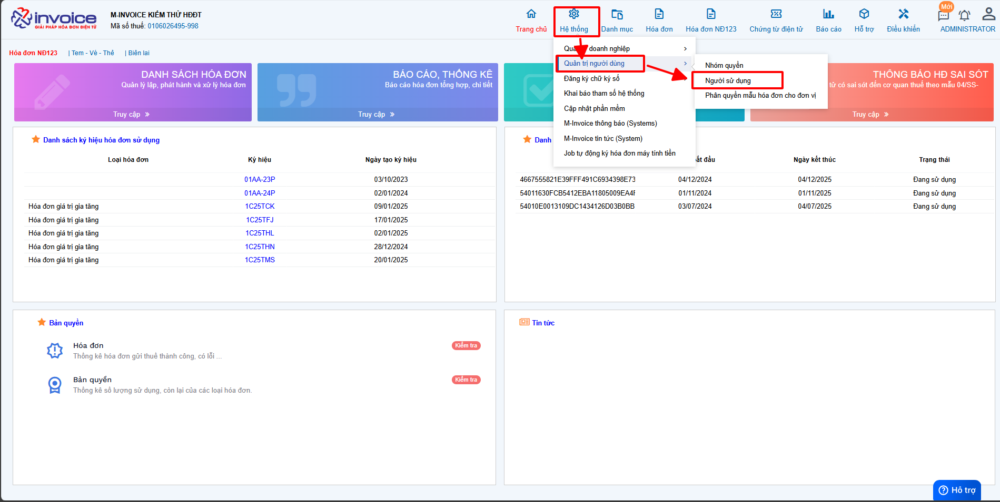
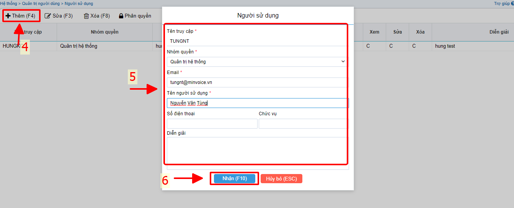
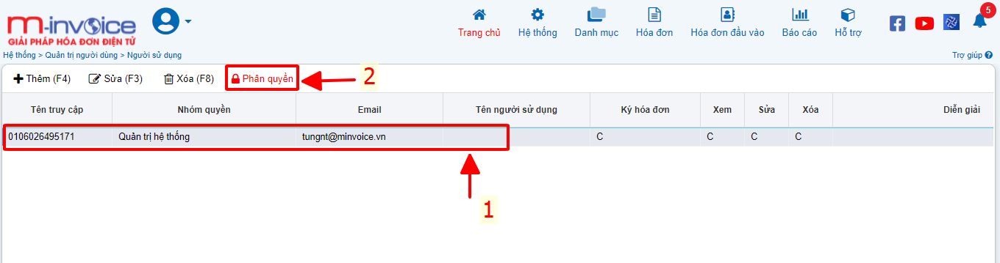
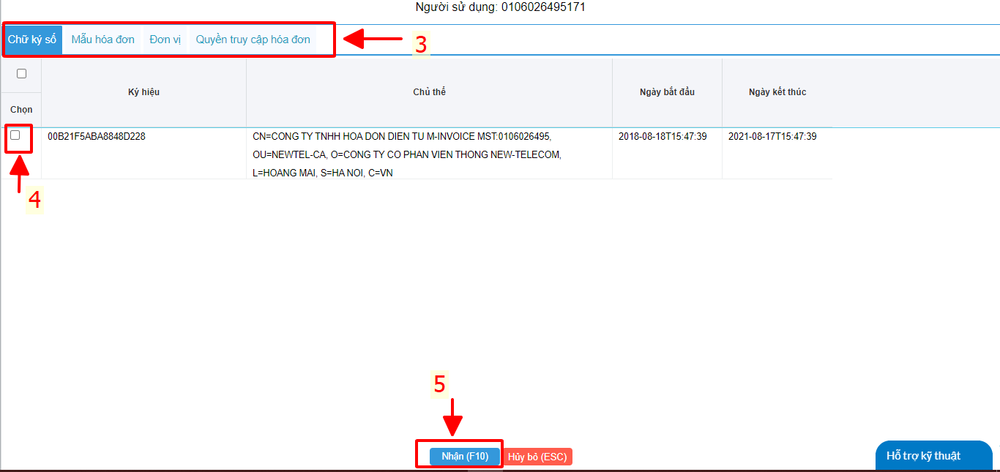

# **Thêm một tài khoản cho người sử dụng mới**

### **Bước 1: K/H vào phân hệ Hệ Thống (1) . Chọn quản trị người dùng (2), chọn người sử dụng (3)**

### **Bước 2: Sau khi vào giao diện Người sử dụng, K/H ấn Thêm (F4) (4).**

### **Bước 3 : Sau đó K/H nhập từng thông tin người sử dụng đó để thêm. Lưu ý những trường đánh dấu (\*) K/H bắt buộc phải nhập.**

### **Bước 4: Sau khi nhập xong thông tin K/H ấn Nhận (F10). Hệ thống sẽ gửi mật khẩu về email mà K/H đăng ký lúc tạo tài khoản**

### **Bước 5: K/H chọn vào (1) người sử dụng cần phân quyền, sau đó ấn (2) Phân quyền**

### **Bước 6: Sau khi phân quyền xong K/H ấn nhận(F10) (5)**

!!! info "Xin chân thành cảm ơn Quý khách hàng đã tin dùng sản phẩm của M-Invoice"

    Có bất kỳ vướng mắc nào trong quá trình sử dụng hãy liên hệ với M-Invoice tại mục Hỗ trợ kỹ thuật góc phải bên dưới màn hình hoặc gọi tổng đài kỹ thuật của M-Invoice (1900.955.557 Nhánh 1)

Last updated on <strong>Jun 5, 2025</strong> by <strong>nhatth</strong>

