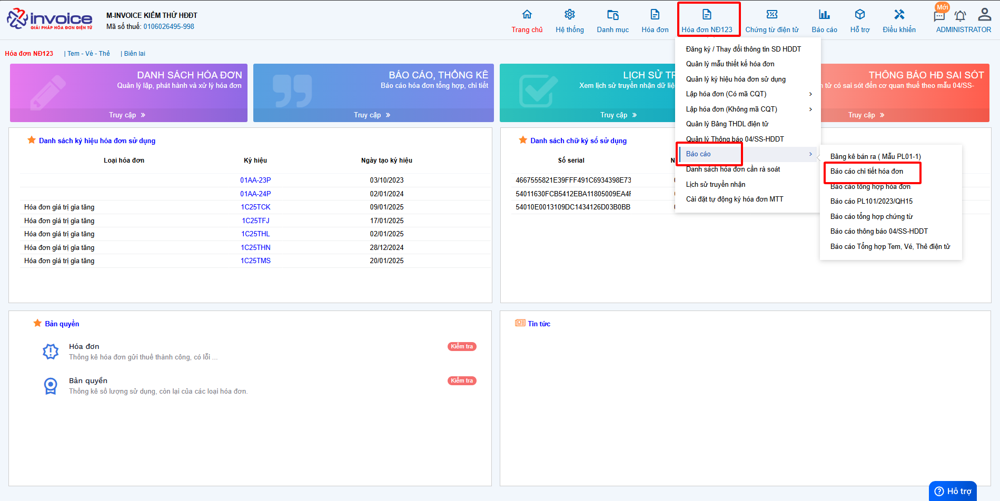
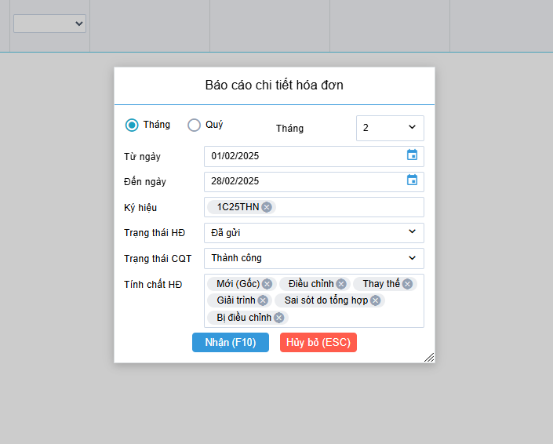
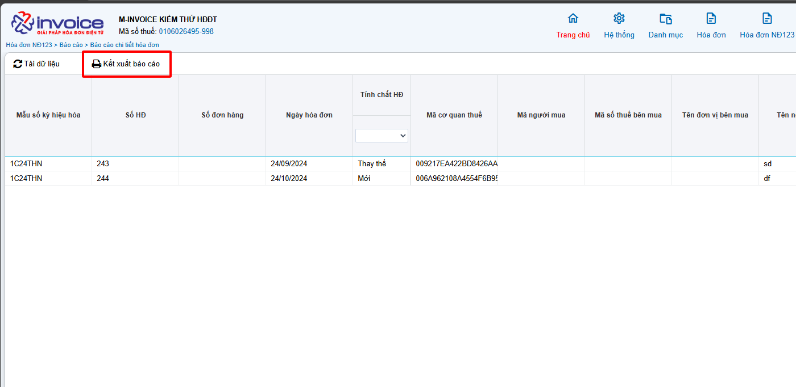
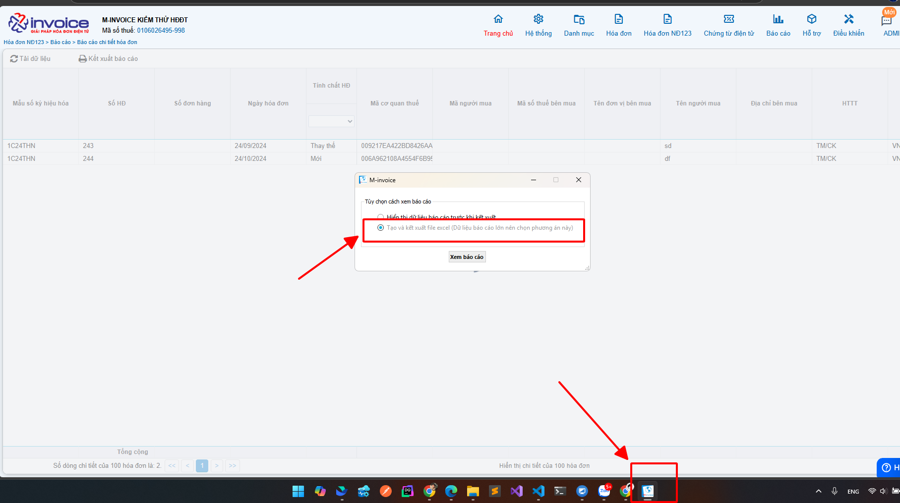

# **Báo cáo chi tiết hoá đơn theo NĐ123**

## **Hướng dẫn xem và tải báo cáo chi tiết hóa đơn NĐ123**

_<small>Lưu ý : để tải được excel báo cáo chi tiết hoá đơn, các bạn phải cài đặt plugin ký số Minvoice</small>_ [Hướng dẫn cài đặt Plugin](../../assets/images/invoice1/1.0_caiPlugin.png)

### Bước 1: Truy cập vào phần Hóa đơn HĐ123 >> Báo cáo >> Báo cáo chi tiết hóa đơn

### Bước 2: Chọn các điều kiện để lọc báo cáo

### Bước 3 : Kết xuất báo cáo

_<small>Lưu ý : nếu đã cài plugin thì phải cập nhật lên phiên bản mới [Hướng dẫn](../../assets/images/invoice1/1.0_capNhatPhanMem.png)</small>_

!!! info "Xin chân thành cảm ơn Quý khách hàng đã tin dùng sản phẩm của M-Invoice"
Có bất kỳ vướng mắc nào trong quá trình sử dụng hãy liên hệ với M-Invoice tại mục Hỗ trợ kỹ thuật góc phải bên dưới màn hình hoặc gọi tổng đài kỹ thuật của M-Invoice (1900.955.557 Nhánh 1)

