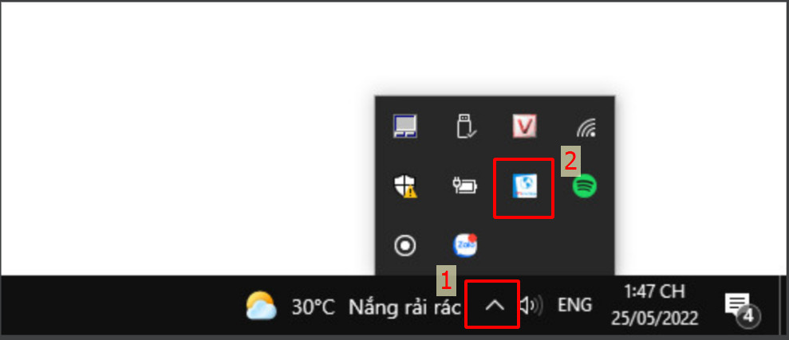
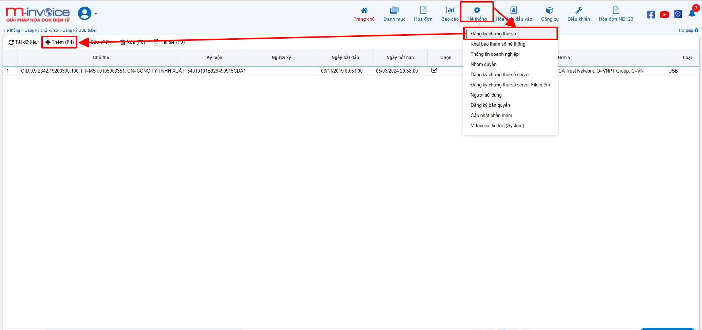
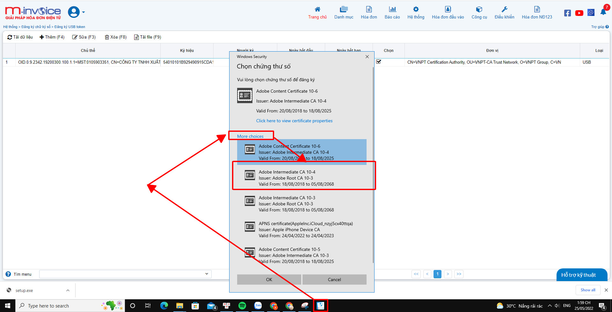
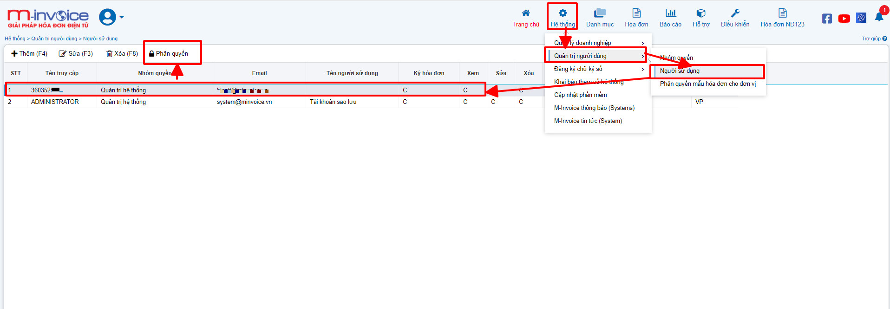
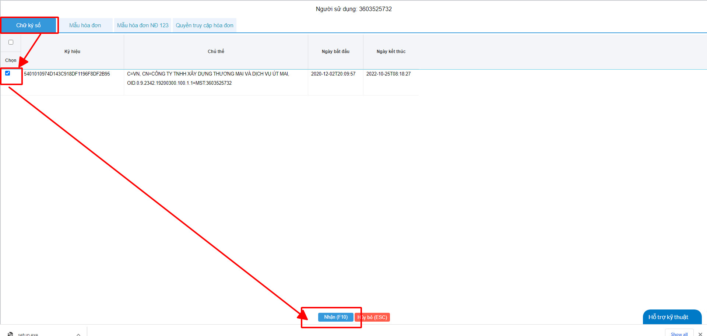
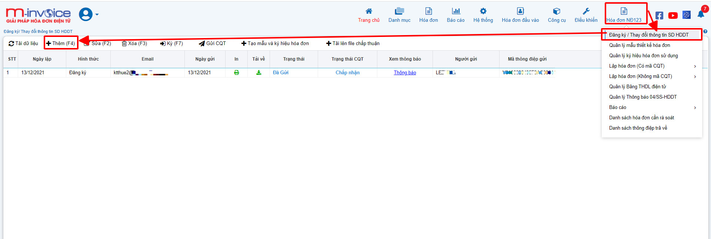
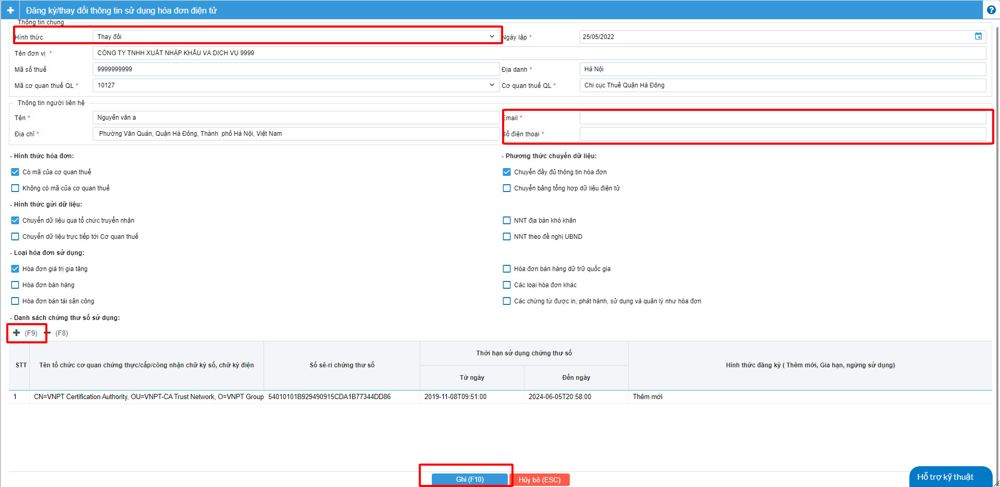
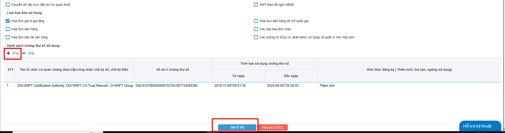
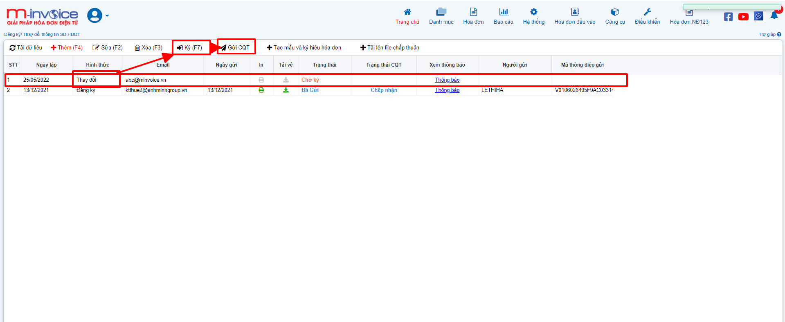

# **Hướng dẫn thay đổi CKS hoặc add thêm CKS mới vào phần mềm**

<!-- [^1]:
    In 2016, Material for MkDocs started out as a simple theme for MkDocs, but
    over the course of several years, it's now much more than that – with the
    many built-in plugins, settings, and countless customization abilities,
    Material for MkDocs is now one of the simplest and most powerful frameworks
    for creating documentation for your project.

[MkDocs]: https://www.mkdocs.org
[pip]: #with-pip
[docker]: #with-docker -->

### Bước 1: Cắm CKS vào máy tính, kiểm tra xem plugin đã được bật chưa



Click vào biểu tượng HIDE (hay dẫu mũi tên chỉ lên) (1) nếu có biểu tượng Plugin của Minvoice như thế plugin đã bật thành công

Nếu chưa, bạn chỉ cần gõ vào ô tìm kiếm của window ( window + S) tìm kiếm Mivoice - Plugin rồi bật nó lên là được.

### Bước 2: Thêm CKS vào phần mềm Minvoice



Các bạn vào Hệ thông >> Đăng ký chữ ký số >> Thêm (F4)



Ở thanh Taskbar sẽ hiển thị lên biểu tượng của công cụ Plugin Minvoice, các bạn chọn vào đó để thêm CKS mới của mình

### Bước 3 : Phân quyền CKS cho người dùng



Các bạn vào Hệ thống >>> Quản trị người dùng >>> Người sử dùng
Chọn tài khoản mà bạn sử dụng >> chọn nút Phân quyền



Chọn vào mục Chữ ký số tích chọn vào cks mình vừa thêm vào , sau đó nhấn Nhận (F10)

### Bước 4: Làm tờ khai 01 thay đổi lên thuế về việc thay đổi CKS



Bạn vào Hóa đơn NĐ123 >> Đăng ký/ Thay đổi thông tin SD HDDT


!!! note "Ghi chú"
       - Hình thức chọn Thay đổi
       - Địa danh chọn tỉnh thành phố hiện tại
       - Mã cơ quan thuế quản lý chọn mã cơ quan thuế quản lý tương ứng
       - Email, số điện thoại Bạn điền mail và sđt của giám đốc hoặc kế toán trưởng
       - Hình thức hóa đơn : Chọn loại có mã của CQT hoặc không có mã
       - Phương thức truyền dữ liệu : Chọn Chuyền đẩy đủ thông tin hóa đơn
       - Hình thức gửi dữ liệu : Chọn Chuyền dữ liệu qua tổ chức truyền nhận
       - Loại hóa đơn : Chọn loại hóa đơn mà bạn đang sử dụng



Tiếp sau đó nhấn phím dấu + (F9) để tiến hành thêm cks mới vào tờ khai (Giống như thêm cks vào phần mềm ở bước trên)
Khi thêm xong chúng ta nhấn Ghi (F10)



Như vậy đã xuất hiện ra 1 tờ thay đổi mới, việc của chúng ta chỉ cần Ký (F7) và Gửi CQT để gửi tờ khai 01 về việc thay đổi đổi CKS

### Bước 5: Việc của chúng ta bây giờ là đợi CQT chấp nhận cho chúng ta sử dụng CKS mới (Thông thường quá trình này sẽ mất khoảng 1 ngày) là chúng ta có thể ký được bằng CKS mới bình thường

!!! info "Xin chân thành cảm ơn Quý khách hàng đã tin dùng sản phẩm của M-Invoice"
    Có bất kỳ vướng mắc nào trong quá trình sử dụng hãy liên hệ với M-Invoice tại mục Hỗ trợ kỹ thuật góc phải bên dưới màn hình hoặc gọi tổng đài kỹ thuật của M-Invoice (1900.955.557 Nhánh 1)


<!-- === "Latest"

    ``` sh
    pip install mkdocs-material
    ```

=== "9.x"

    ``` sh
    pip install mkdocs-material=="9.*" # (1)!
    ```

    1.  Material for MkDocs uses [semantic versioning][^2], which is why it's a
        good idea to limit upgrades to the current major version.

        This will make sure that you don't accidentally [upgrade to the next
        major version], which may include breaking changes that silently corrupt
        your site. Additionally, you can use `pip freeze` to create a lockfile,
        so builds are reproducible at all times:

        ```
        pip freeze > requirements.txt
        ```

        Now, the lockfile can be used for installation:

        ```
        pip install -r requirements.txt
        ```

[^2]:
    Note that improvements of existing features are sometimes released as
    patch releases, like for example improved rendering of content tabs, as
    they're not considered to be new features.

This will automatically install compatible versions of all dependencies:
[MkDocs], [Markdown], [Pygments] and [Python Markdown Extensions]. Material for
MkDocs always strives to support the latest versions, so there's no need to
install those packages separately.

---

:fontawesome-brands-youtube:{ style="color: #EE0F0F" }
**[How to set up Material for MkDocs]** by @james-willett – :octicons-clock-24:
27m – Learn how to create and host a documentation site using Material for
MkDocs on GitHub Pages in a step-by-step guide.

[How to set up Material for MkDocs]: https://www.youtube.com/watch?v=xlABhbnNrfI

---

!!! tip

    If you don't have prior experience with Python, we recommend reading
    [Using Python's pip to Manage Your Projects' Dependencies], which is a
    really good introduction on the mechanics of Python package management and
    helps you troubleshoot if you run into errors.

[Python package]: https://pypi.org/project/mkdocs-material/
[virtual environment]: https://realpython.com/what-is-pip/#using-pip-in-a-python-virtual-environment
[semantic versioning]: https://semver.org/
[upgrade to the next major version]: upgrade.md
[Markdown]: https://python-markdown.github.io/
[Pygments]: https://pygments.org/
[Python Markdown Extensions]: https://facelessuser.github.io/pymdown-extensions/
[Using Python's pip to Manage Your Projects' Dependencies]: https://realpython.com/what-is-pip/

### with docker

The official [Docker image] is a great way to get up and running in a few
minutes, as it comes with all dependencies pre-installed. Open up a terminal
and pull the image with:

=== "Latest"

    ```
    docker pull squidfunk/mkdocs-material
    ```

=== "9.x"

    ```
    docker pull squidfunk/mkdocs-material:9
    ```

The `mkdocs` executable is provided as an entry point and `serve` is the
default command. If you're not familiar with Docker don't worry, we have you
covered in the following sections.

The following plugins are bundled with the Docker image:

- [mkdocs-minify-plugin]
- [mkdocs-redirects]

  [Docker image]: https://hub.docker.com/r/squidfunk/mkdocs-material/
  [mkdocs-minify-plugin]: https://github.com/byrnereese/mkdocs-minify-plugin
  [mkdocs-redirects]: https://github.com/datarobot/mkdocs-redirects

??? question "How to add plugins to the Docker image?"

    Material for MkDocs only bundles selected plugins in order to keep the size
    of the official image small. If the plugin you want to use is not included,
    you can add them easily:

    === "Material for MkDocs"

        Create a `Dockerfile` and extend the official image:

        ``` Dockerfile title="Dockerfile"
        FROM squidfunk/mkdocs-material
        RUN pip install mkdocs-macros-plugin
        RUN pip install mkdocs-glightbox
        ```

    === "Insiders"

        Clone or fork the Insiders repository, and create a file called
        `user-requirements.txt` in the root of the repository. Then, add the
        plugins that should be installed to the file, e.g.:

        ``` txt title="user-requirements.txt"
        mkdocs-macros-plugin
        mkdocs-glightbox
        ```

    Next, build the image with the following command:

    ```
    docker build -t squidfunk/mkdocs-material .
    ```

    The new image will have additional packages installed and can be used
    exactly like the official image.

### with git

Material for MkDocs can be directly used from [GitHub] by cloning the
repository into a subfolder of your project root which might be useful if you
want to use the very latest version:

```
git clone https://github.com/squidfunk/mkdocs-material.git
```

Next, install the theme and its dependencies with:

```
pip install -e mkdocs-material
```

[GitHub]: https://github.com/squidfunk/mkdocs-material -->
